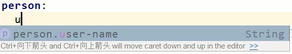
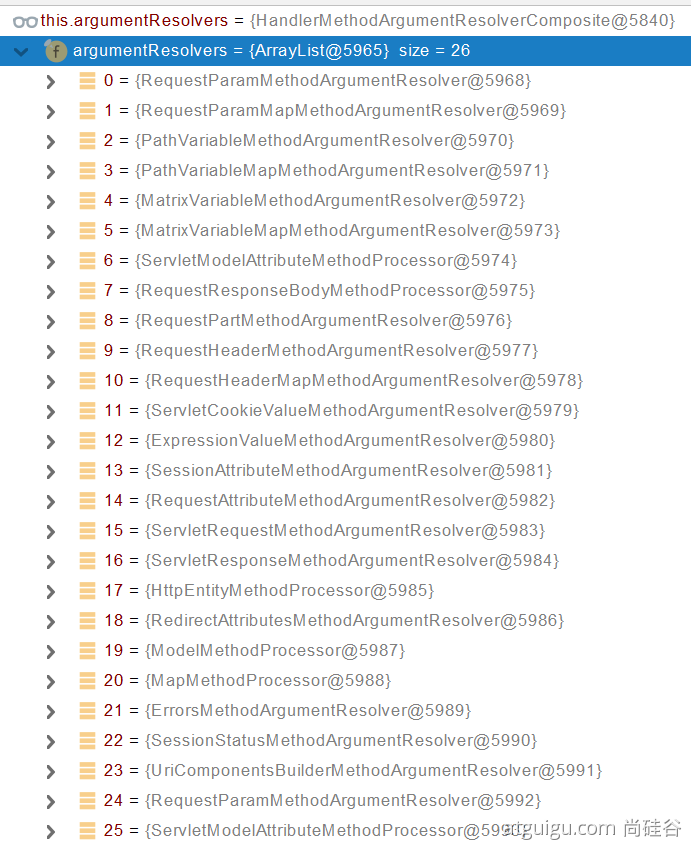
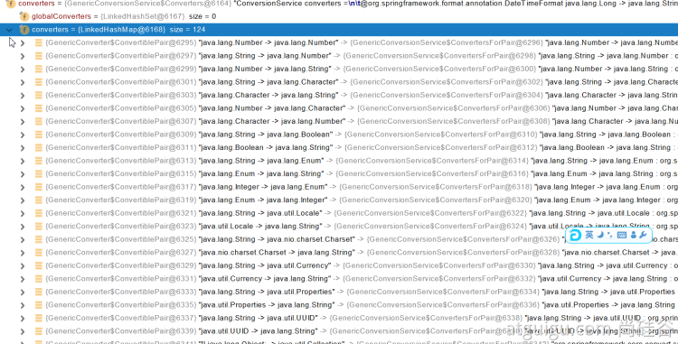

# Albrus-Spring Boot
(:3[▓▓▓▓▓▓▓▓]
> Systematically study Spring Boot and practice and record to deepen understanding.
>
> https://docs.spring.io/spring-boot/docs/current/reference/htmlsingle/

## 一、时代背景

Spring Boot makes it easy to create stand-alone, production-grade Spring based Applications that you can "just run".

==**Spring 5 重大升级之响应式编程！！！**==

还得益于 JDK 8，优化源码架构设计。

**Spring Boot 优点：**

- 创建独立 Spring 应用
- 内嵌 web 服务器
- starter 组件式依赖，简化组件包引入程序，简化版本依赖
- 自动配置 Spring 和第三方功能
- 提供生产级别的监控、健康检查及外部化配置
- 无代码生成，无需编写 XML

**时代背景：**

**微服务：**

微服务概念于 2014 年被[完整](https://martinfowler.com/microservices/)提出：

- 微服务是一种架构风格
- 一个应用拆分为一组小型服务
- 每个服务运行在自己的进程内，也就是可独立部署和升级
- 服务之间使用轻量级HTTP交互
- 服务围绕业务功能拆分
- 可以由全自动部署机制独立部署
- 去中心化，服务自治。服务可以使用不同的语言、不同的存储技术

**分布式：**

- 远程调用

- 服务发现

- 负载均衡

- 服务容错

- 配置管理

- 服务监控

- 链路追踪

  一个复杂的业务流程可能需要连续调用多个微服务，我们需要记录一个完整业务逻辑涉及的每一个微服务的运行状态，再通过可视化**链路图**展现，帮助软件工程师在系统出错时分析解决问题，常见的解决方案有 Zipkin，SkyWalking。

- 日志管理

  微服务架构默认将应用日志分散保存在每一个微服务节点上，当系统进行用户行为分析、数据统计时必须收集所有节点日志数据，非常不方便。这时候我们需要一个独立的日志平台，**收集**所有节点的日志数据并可方便对其进行汇总**分析**，然后进行可视化**展示**，常见的解决方案有ELK（Elasticsearch + Logstash + Kibana），EFK（Elasticsearch + Fluentd + Kibana）。

- 任务调度

- ......

**云原生：**

- 服务自愈
- 弹性伸缩
- 服务隔离
- 自动化部署
- 灰度开发
- 流量治理
- ......

## 二、依赖管理

> 自动管理依赖版本。

### 2.1 parent

```xml
<parent>
    <groupId>org.springframework.boot</groupId>
    <artifactId>spring-boot-starter-parent</artifactId>
    <version>2.6.7</version>
    <relativePath/> <!-- lookup parent from repository -->
</parent>
```

能够更方便地升级依赖组件的版本，设置 `properties` 即可：

```xml
spring-boot-dependencies-2.6.7.pom
<properties>
    <activemq.version>5.16.4</activemq.version>
    <antlr2.version>2.7.7</antlr2.version>
    <appengine-sdk.version>1.9.96</appengine-sdk.version>
    <artemis.version>2.19.1</artemis.version>
    <aspectj.version>1.9.7</aspectj.version>
    ...
</properties>
```

### 2.2 dependencies

```xml
<properties>
    <spring-boot.version>2.6.7</spring-boot.version>
</properties>

<dependencyManagement>
    <dependencies>
        <dependency>
            <groupId>org.springframework.boot</groupId>
            <artifactId>spring-boot-dependencies</artifactId>
            <version>${spring-boot.version}</version>
            <type>pom</type>
            <scope>import</scope>
        </dependency>
    </dependencies>
</dependencyManagement>
```

升级依赖组件的版本需要写全 GAV 坐标。

## 三、自动配置

- 自动配置 Tomcat

- 自动配置 Spring MVC

- 自动配置 Web 常见功能，如：字符编码

- 默认包扫描

  主程序所在包及其子包

- 各种配置拥有默认值

  可以通过修改 `application.properties/application.yaml` 配置达到快速修改默认值的目的

- 按需加载

- 。。。

## 四、底层注解

### 4.1 `@Configuration`

- 是一个配置类 > 配置文件，使用 `@Bean` 给容器注册组件

- 配置类本身也是组件：`XxxConfiguration$$EnhancerBySpringCGLIB$$3f51e91b@22d6cac2`

- 在 Spring Boot 2 (Spring 5.2) 之后引入了一个属性：`boolean proxyBeanMethods() default true;`

  ```java
  public @interface Configuration {
      boolean proxyBeanMethods() default true;
  }
  ```

  - Full：为 `true` 时，`XxxConfiguration` 注册的是一个代理对象：**`XxxConfiguration$$EnhancerBySpringCGLIB`**

    通过 `XxxConfiguration` 对象调用里面的 `@Bean` 方法（单例时）返回的都是同一个对象，**会保持单例模式**

  - Lite：为 `false` 时，每次调用都会重新创建一个对象

  `Full(proxyBeanMethods = true)` 下，可以解决组件依赖问题：

  ```java
  @Configuration
  public class AlbrusConfiguration {
      @Bean
      public User user() {
          User user = new User();
          // 组件依赖
          user.setPet(pet());
          return user;
      }
      
      @Bean
      public Pet pet() {
          return new Pet();
      }
  }
  ```

  **如何选择 Full || Lite ？**如果仅仅是添加简单的 Bean 组件（没有组件依赖、不会手动调用 `XxxConfiguration` 对象的 `@Bean` 方法），可以修改为 `false` 增加启动速度。

### 4.2 `@Bean、@Component、@Controller、@Service、@Repository`

常用注解。

### 4.3 `@ComponentScan、@Import`

`@Import` 注解注册的组件，默认名称为**全类名**。

### 4.4 `@Conditional`

条件装配：


### 4.5 `@ImportResource`

导入原生配置文件引用：`@ImportResource("classpath:beans.xml")`。

### 4.6 `@ConfigurationProperties`

> 只有容器中的类可以使用 `@ConfigurationProperties` 注解。

1. 为容器中的组件加注解：`@ConfigurationProperties(prefix = "albrus")`

2. 在配置类上 `@EnableConfigurationProperties(Cat.class)` + `@ConfigurationProperties(prefix = "albrus")`

   可以用于为导入的第三方包组件设置初始值。

## 五、自动配置原理

```java
@SpringBootConfiguration
@EnableAutoConfiguration
@ComponentScan(excludeFilters = { @Filter(type = FilterType.CUSTOM, classes = TypeExcludeFilter.class),
		@Filter(type = FilterType.CUSTOM, classes = AutoConfigurationExcludeFilter.class) })
public @interface SpringBootApplication {...}
```

### 5.1 `@SpringBootConfiguration`

```java
@Configuration
@Indexed
public @interface SpringBootConfiguration {

	/**
	 * @return whether to proxy {@code @Bean} methods
	 * @since 2.2
	 */
	@AliasFor(annotation = Configuration.class)
	boolean proxyBeanMethods() default true;

}
```

是一个 `@Configuration` 配置类。

### 5.2 `@ComponentScan`

指定包扫描路径。

### 5.3 `@EnableAutoConfiguration`

```java
@AutoConfigurationPackage
@Import(AutoConfigurationImportSelector.class)
public @interface EnableAutoConfiguration {...}
```

1. `@AutoConfigurationPackage`

   ```java
   @Import(AutoConfigurationPackages.Registrar.class)
   public @interface AutoConfigurationPackage {...}
   ```

   给容器导入一个 `AutoConfigurationPackages.Registrar` 组件：

   ```java
   // org.springframework.boot.autoconfigure.AutoConfigurationPackages#register
   registry.registerBeanDefinition(BEAN, new BasePackagesBeanDefinition(packageNames));
   ```

   `packageNames`：`@SpringBootApplication` 启动类的包路径，也就是==**配置默认的包扫描路径**==。

2. `@Import(AutoConfigurationImportSelector.class)`

   给容器导入一个 `AutoConfigurationImportSelector` 组件：

   ```java
   public class AutoConfigurationImportSelector implements DeferredImportSelector, BeanClassLoaderAware, ResourceLoaderAware, BeanFactoryAware, EnvironmentAware, Ordered {
       
       @Override
       public String[] selectImports(AnnotationMetadata annotationMetadata) {
           if (!isEnabled(annotationMetadata)) {
               return NO_IMPORTS;
           }
           // 为容器自动注入的组件
           AutoConfigurationEntry autoConfigurationEntry = getAutoConfigurationEntry(annotationMetadata);
           return StringUtils.toStringArray(autoConfigurationEntry.getConfigurations());
       }
       
       /**
   	 * Return the auto-configuration class names that should be considered. By default
   	 * this method will load candidates using {@link SpringFactoriesLoader} with
   	 * {@link #getSpringFactoriesLoaderFactoryClass()}.
   	 * @param metadata the source metadata
   	 * @param attributes the {@link #getAttributes(AnnotationMetadata) annotation
   	 * attributes}
   	 * @return a list of candidate configurations
   	 */
   	protected List<String> getCandidateConfigurations(AnnotationMetadata metadata, AnnotationAttributes attributes) {
           // **重点**
   		List<String> configurations = SpringFactoriesLoader.loadFactoryNames(getSpringFactoriesLoaderFactoryClass(),
   				getBeanClassLoader());
   		Assert.notEmpty(configurations, "No auto configuration classes found in META-INF/spring.factories. If you "
   				+ "are using a custom packaging, make sure that file is correct.");
   		return configurations;
   	}
   }
   ```

   **重点关注：**

   ```java
   protected Class<?> getSpringFactoriesLoaderFactoryClass() {
       return EnableAutoConfiguration.class;
   }
   
   public final class SpringFactoriesLoader {
   	/**
   	 * The location to look for factories.
   	 * <p>Can be present in multiple JAR files.
   	 */
   	public static final String FACTORIES_RESOURCE_LOCATION = "META-INF/spring.factories";
   }
   ```

   也就是说，==**从 `META-INF/spring.factories` 文件中，取出 `EnableAutoConfiguration.class` 对应的值：Class 集合**==。

   组件具体加载不加载，依据 Spring Boot 的按需加载机制决定。

### 5.4 修复默认配置

```java
// org.springframework.boot.autoconfigure.web.servlet.DispatcherServletAutoConfiguration
@Bean
@ConditionalOnBean(MultipartResolver.class)
@ConditionalOnMissingBean(name = DispatcherServlet.MULTIPART_RESOLVER_BEAN_NAME)
public MultipartResolver multipartResolver(MultipartResolver resolver) {
    // Detect if the user has created a MultipartResolver but named it incorrectly
    return resolver;
}
```

组合拳：`@ConditionalOnBean` + `@ConditionalOnMissingBean`

### 5.5 `SpringBootCondition`？

`Condition` 生效？

```java
// org.springframework.context.annotation.ConditionEvaluator#shouldSkip
/**
 * Determine if an item should be skipped based on {@code @Conditional} annotations.
 * @param metadata the meta data
 * @param phase the phase of the call
 * @return if the item should be skipped
 */
public boolean shouldSkip(@Nullable AnnotatedTypeMetadata metadata, @Nullable ConfigurationPhase phase) {
    if (metadata == null || !metadata.isAnnotated(Conditional.class.getName())) {
        return false;
    }

    if (phase == null) {
        if (metadata instanceof AnnotationMetadata &&
            ConfigurationClassUtils.isConfigurationCandidate((AnnotationMetadata) metadata)) {
            return shouldSkip(metadata, ConfigurationPhase.PARSE_CONFIGURATION);
        }
        return shouldSkip(metadata, ConfigurationPhase.REGISTER_BEAN);
    }

    // 获取所有
    List<Condition> conditions = new ArrayList<>();
    for (String[] conditionClasses : getConditionClasses(metadata)) {
        for (String conditionClass : conditionClasses) {
            Condition condition = getCondition(conditionClass, this.context.getClassLoader());
            conditions.add(condition);
        }
    }

    AnnotationAwareOrderComparator.sort(conditions);

    for (Condition condition : conditions) {
        ConfigurationPhase requiredPhase = null;
        if (condition instanceof ConfigurationCondition) {
            requiredPhase = ((ConfigurationCondition) condition).getConfigurationPhase();
        }
        if ((requiredPhase == null || requiredPhase == phase) && !condition.matches(this.context, metadata)) {
            return true;
        }
    }

    return false;
}
```

## 六、常用插件

### 6.1 lombok

### 6.2 dev-tools

`dev-tools` 是 restart 级别的插件，如果想要支持热更新 reload，需要使用付费 ==**JRebel**==。

## 七、yaml

### 7.1 字符串

- 可以不加单引号或双引号
- 单引号会转义字符，例如 `\n` -> `\\n` 进行原样输出
- 双引号不会转移字符，例如 `\n` 会被输出为换行

### 7.2 配置提示

Annotation Processor：`spring-boot-configuration-processor`

添加引用后，在 `yaml` 中配置自定义配置时将会有提示：

注意，打包的时候需要将其排除：

## 八、Web 开发

### 8.1 接管 Spring MVC

1. **不用 `@EnableWebMvc` 注解。使用 `@Configuration` + `WebMvcConfigurer` 自定义规则**

   > If you want to keep those Spring Boot MVC customizations and make more [MVC customizations](https://docs.spring.io/spring/docs/5.2.9.RELEASE/spring-framework-reference/web.html#mvc) (interceptors, formatters, view controllers, and other features), you can add your own `@Configuration` class of type `WebMvcConfigurer` but **without** `@EnableWebMvc`.

2. **声明 `WebMvcRegistrations` 改变默认底层组件，自定义 `RequestMappingHandlerMapping`**

   > If you want to provide custom instances of `RequestMappingHandlerMapping`, `RequestMappingHandlerAdapter`, or `ExceptionHandlerExceptionResolver`, and still keep the Spring Boot MVC customizations, you can declare a bean of type `WebMvcRegistrations` and use it to provide custom instances of those components.

3. **使用 `@EnableWebMvc + @Configuration+DelegatingWebMvcConfiguration` 全面接管Spring MVC**

   > If you want to take complete control of Spring MVC, you can add your own `@Configuration` annotated with `@EnableWebMvc`, or alternatively add your own `@Configuration`-annotated `DelegatingWebMvcConfiguration` as described in the Javadoc of `@EnableWebMvc`.

   一旦使用 `@EnableWebMvc`，会自动导入 `DelegatingWebMvcConfiguration`，该配置类继承于 `WebMvcConfigurationSupport`；而 `WebMvcAutoConfiguration` 的一大条件便是 `@ConditionalOnMissingBean(WebMvcConfigurationSupport.class)`，所以 MVC 的自动配置不会生效，将由我们全面接管 Spring MVC。

   `DelegatingWebMvcConfiguration` 的作用：Spring Boot 会获取容器中的所有 `WebMvcConfigurer` 接口类型的实例对象，在合适的时候调用接口中的方法用以扩展 Spring Boot 底层内置的组件。

   `WebMvcAutoConfiguration` 中也有一个该类型的静态内部类实现：

   ```java
   @Configuration(proxyBeanMethods = false)
   @EnableConfigurationProperties(WebProperties.class)
   public static class EnableWebMvcConfiguration extends DelegatingWebMvcConfiguration implements ResourceLoaderAware {...}
   ```

### 8.2 基础功能分析

#### 8.2.1 静态资源访问目录

静态资源可以放在以下目录：

- `/static`
- `/public`
- `/resources`
- `/META-INF/resources`

访问规则：项目根路径 + 静态资源名

原理：先去 **Controller** 中找映射，找不到再交给**静态资源处理器**处理，还是找不到就 404。

#### 8.2.2 静态资源路径

```yaml
spring:
  mvc:
    static-path-pattern: /res/**

  resources:
    static-locations: [classpath:/albrus/]
```

解释：静态资源去 `/albrus/` 文件夹下寻找，并且访问路径需要添加前缀 `/res/`

#### 8.2.3 webjar

> 自动映射：`/webjars/**`：`http://localhost:8080/webjars/jquery/3.5.1/jquery.js`

```xml
<dependency>
    <groupId>org.webjars</groupId>
    <artifactId>jquery</artifactId>
    <version>3.5.1</version>
</dependency>
```

### 8.3 欢迎页支持

欢迎页：静态资源下添加 `index.html` 页面

favicon：静态资源下添加 `favicon.ico` 图标

注意：`static-path-pattern` 会影响 欢迎页 和 favicon！

不存在静态页面 `index.html` 时会判断是否有动态的欢迎页，即 Controller 下有没有：

```java
WelcomePageHandlerMapping(TemplateAvailabilityProviders templateAvailabilityProviders,
                          ApplicationContext applicationContext, Optional<Resource> welcomePage, String staticPathPattern) {
    if (welcomePage.isPresent() && "/**".equals(staticPathPattern)) {
        // 要用欢迎页功能，必须是/**
        logger.info("Adding welcome page: " + welcomePage.get());
        setRootViewName("forward:index.html");
    }
    else if (welcomeTemplateExists(templateAvailabilityProviders, applicationContext)) {
        // 调用Controller  /index
        logger.info("Adding welcome page template: index");
        setRootViewName("index");
    }
}
```

### 8.4 REST

```yaml
spring:
  mvc:
    hiddenmethod:
      filter:
        enabled: true   #开启页面表单的Rest功能
```

- ==表单提交==带上：`_method=PUT`
- 请求被 `HiddenHttpMethodFilter` 拦截

- - 请求是否正常，并且是POST

- - - 获取 `_method`的值
    - 兼容以下请求：`PUT、DELETE、PATCH`
    - **原生 `request(post)`，包装模式 `requesWrapper` 重写了 `getMethod` 方法，以后的方法调用 `getMethod` 是调用 `requesWrapper`**

表单提交仅支持 `GET、POST`，例如 Post Man 原生支持无需借助 `HiddenHttpMethodFilter`。

**自动有默认的 `_method`？**

自定义一个 `HiddenHttpMethodFilter`，

### 8.5 `DispatcherServlet`

```java
DispatcherServlet extends FrameworkServlet
    -> extends HttpServletBean
        -> extends HttpServlet
```

请求路径：

`HttpServlet#doGet() > FrameworkServlet#doGet() > FrameworkServlet#processRequest() -> DispatcherServlet#doService() > DispatcherServlet#doDispatch()`

```java
protected void doDispatch(HttpServletRequest request, HttpServletResponse response) throws Exception {
		HttpServletRequest processedRequest = request;
		HandlerExecutionChain mappedHandler = null;
		boolean multipartRequestParsed = false;

		WebAsyncManager asyncManager = WebAsyncUtils.getAsyncManager(request);

		try {
			ModelAndView mv = null;
			Exception dispatchException = null;

			try {
				processedRequest = checkMultipart(request);
				multipartRequestParsed = (processedRequest != request);

				// 找到当前请求使用哪个 Handler（Controller的方法）处理
				mappedHandler = getHandler(processedRequest);
                
                // HandlerMapping：处理器映射。/xxx->>xxxx
            }
        }
    
    // ...
}
```

`getHandler()`

```java
protected HandlerExecutionChain getHandler(HttpServletRequest request) throws Exception {
		if (this.handlerMappings != null) {
			for (HandlerMapping mapping : this.handlerMappings) {
				HandlerExecutionChain handler = mapping.getHandler(request);
				if (handler != null) {
					return handler;
				}
			}
		}
		return null;
	}
```

Spring Boot 自动配置了默认的 `RequestMappingHandlerMapping`，里面包含了所有 `@RequestMapping` 的映射规则：

**`DispatcherServlet#List<HandlerMapping>` 排序：**

```java
// org.springframework.web.servlet.DispatcherServlet#initHandlerMappings
private void initHandlerMappings(ApplicationContext context) {
    AnnotationAwareOrderComparator.sort(this.handlerMappings);
}
```

`RequestMappingHandlerMapping` 是 `AbstractHandlerMapping` 的子类，`AbstractHandlerMapping` 实现了 `Ordered` 接口，且 `RequestMappingHandlerMapping mapping = createRequestMappingHandlerMapping();mapping.setOrder(0);`

### 8.6 参数处理及原理

#### 8.6.1 常用注解

`@PathVariable、@RequestHeader、@ModelAttribute、@RequestParam、@MatrixVariable、@CookieValue、@RequestBody`

- `@RequestParam`：可用来获取表单提交中的单个参数

  ```java
  /**
   * Content-Type: application/x-www-form-urlencoded
   * 可以用 @RequestParam 接收
   */
  @PostMapping("/dog2")
  public Dog dog2(@RequestParam String name) {
      System.out.println("My dog: " + name);
      Dog dog = new Dog();
      dog.setName(name);
  
      return dog;
  }
  ```

#### 8.6.2 不常用注解

##### 8.6.2.1 `@RequestAttribute & @MatrixVariable`

`@RequestAttribute`：从 Request Attributes 中获取

`@MatrixVariable`：矩阵变量（**Spring Boot 默认禁用了矩阵变量**）：

- 原理
  - 对于路径的处理，使用 `UrlPathHelper` 实现的
  - **`UrlPathHelper` 有一个 `removeSemicolonContent` 属性，默认是 `true`：移除分号内容**
- 示例
  - `/cars/{path}?xxxx=xxxx&yyyy=yyyy` --> `@ResuestParam`
  - `/cars/{path;xxxx=xxxx;yyyy=yyyy}` --> `@MatrixVariable`，用英文 `;` 分割
  - `cars/{path1;x=x;y=y}/{path2;z=z}`

##### 8.6.2.2 开启矩阵变量（`WebMvcConfigurer`）

Spring Boot 会获取容器中的所有 `WebMvcConfigurer` 接口类型的实例对象，在合适的时候调用接口中的方法：

```java
@Configuration(proxyBeanMethods = false)
public class DelegatingWebMvcConfiguration extends WebMvcConfigurationSupport {

	private final WebMvcConfigurerComposite configurers = new WebMvcConfigurerComposite();


    // 获取容器中的 WebMvcConfigurer 并设置
	@Autowired(required = false)
	public void setConfigurers(List<WebMvcConfigurer> configurers) {
		if (!CollectionUtils.isEmpty(configurers)) {
			this.configurers.addWebMvcConfigurers(configurers);
		}
	}


    // 底层便是调用 WebMvcConfigurer 接口的方法
	@Override
	protected void configurePathMatch(PathMatchConfigurer configurer) {
		this.configurers.configurePathMatch(configurer);
	}
    
    // 调用 WebMvcConfigurer 接口的其他方法 ...
}

class WebMvcConfigurerComposite implements WebMvcConfigurer {
    
    @Override
	public void configurePathMatch(PathMatchConfigurer configurer) {
		for (WebMvcConfigurer delegate : this.delegates) {
			delegate.configurePathMatch(configurer);
		}
	}
    
    // 调用 WebMvcConfigurer 接口的其他方法 ...
}
```

在 `MockMvc mockMvc(MockMvcBuilder builder)` 中被调用：

```java
public abstract class AbstractMockMvcBuilder<B extends AbstractMockMvcBuilder<B>>
		extends MockMvcBuilderSupport implements ConfigurableMockMvcBuilder<B> {
    @Override
	@SuppressWarnings("rawtypes")
	public final MockMvc build() {
        // 从这里
		WebApplicationContext wac = initWebAppContext();
		ServletContext servletContext = wac.getServletContext();
        // ...
    }
}

// org.springframework.test.web.servlet.setup.StandaloneMockMvcBuilder#initWebAppContext
public class StandaloneMockMvcBuilder extends AbstractMockMvcBuilder<StandaloneMockMvcBuilder> {
    @Override
	protected WebApplicationContext initWebAppContext() {
		MockServletContext servletContext = new MockServletContext();
		StubWebApplicationContext wac = new StubWebApplicationContext(servletContext);
        // 这里面便是调用逻辑
		registerMvcSingletons(wac);
		servletContext.setAttribute(WebApplicationContext.ROOT_WEB_APPLICATION_CONTEXT_ATTRIBUTE, wac);
		return wac;
	}
}
```

那么开启**矩阵变量**功能，可以在容器中注册一个自定义的 `WebMvcConfigurer` 关闭 `UrlPathHelper.removeSemicolonContent`，`WebMvcConfigurer` 中的其他接口方法同理：

```java
@Bean
public WebMvcConfigurer webMvcConfigurer() {
    return new WebMvcConfigurer() {
        /**
             * 开启矩阵变量
             */
        @Override
        public void configurePathMatch(PathMatchConfigurer configurer) {
            UrlPathHelper urlPathHelper = new UrlPathHelper();
            urlPathHelper.setRemoveSemicolonContent(false);
            configurer.setUrlPathHelper(urlPathHelper);
        }
    }
```

使用示例：

```java
// /cars/sell;low=34;brand=byd,audi,yd
// 3、矩阵变量必须有 URL 路径变量才能被解析
@GetMapping("/cars/{path}")
public Tip carsSell(@MatrixVariable("low") Integer low,
                    @MatrixVariable("brand") List<String> brand,
                    @PathVariable("path") String path) {...}

// /boss/1;age=20/2;age=10
@GetMapping("/boss/{bossId}/{empId}")
public Tip boss(@MatrixVariable(value = "age",pathVar = "bossId") Integer bossAge,
                @MatrixVariable(value = "age",pathVar = "empId") Integer empAge) {...}
```

#### 8.6.3 参数解析原理

获取到 `HandlerExecutionChain mappedHandler` 过后，再交由 `HandlerAdapter ha` 去执行具体的业务方法，包括参数解析和返回值解析：

```java
protected void doDispatch(HttpServletRequest request, HttpServletResponse response) throws Exception {
    HttpServletRequest processedRequest = request;
    HandlerExecutionChain mappedHandler = null;
    boolean multipartRequestParsed = false;

    WebAsyncManager asyncManager = WebAsyncUtils.getAsyncManager(request);

    try {
        ModelAndView mv = null;
        Exception dispatchException = null;

        try {
            processedRequest = checkMultipart(request);
            multipartRequestParsed = (processedRequest != request);

            // Determine handler for the current request.
            mappedHandler = getHandler(processedRequest);
            if (mappedHandler == null) {
                noHandlerFound(processedRequest, response);
                return;
            }

            // Determine handler adapter for the current request.
            HandlerAdapter ha = getHandlerAdapter(mappedHandler.getHandler());

            // Process last-modified header, if supported by the handler.
            String method = request.getMethod();
            boolean isGet = HttpMethod.GET.matches(method);
            if (isGet || HttpMethod.HEAD.matches(method)) {
                long lastModified = ha.getLastModified(request, mappedHandler.getHandler());
                if (new ServletWebRequest(request, response).checkNotModified(lastModified) && isGet) {
                    return;
                }
            }

            if (!mappedHandler.applyPreHandle(processedRequest, response)) {
                return;
            }

            // Actually invoke the handler.
            mv = ha.handle(processedRequest, response, mappedHandler.getHandler());

            if (asyncManager.isConcurrentHandlingStarted()) {
                return;
            }

            applyDefaultViewName(processedRequest, mv);
            mappedHandler.applyPostHandle(processedRequest, response, mv);
        }
    }
}
```

`RequestMappingHandlerAdapter`：

最终会来到 `RequestMappingHandlerAdapter` 的 `invokeHandlerMethod()` 中，里面会设置==参数解析器==和==返回值解析器==，通过参数解析器和返回值解析器来处理请求参数和响应数据：

```java
@Nullable
protected ModelAndView invokeHandlerMethod(HttpServletRequest request,
                                           HttpServletResponse response, HandlerMethod handlerMethod) throws Exception {

    ServletWebRequest webRequest = new ServletWebRequest(request, response);
    try {
        WebDataBinderFactory binderFactory = getDataBinderFactory(handlerMethod);
        ModelFactory modelFactory = getModelFactory(handlerMethod, binderFactory);

        // ① 参数解析器、返回值解析器
        ServletInvocableHandlerMethod invocableMethod = createInvocableHandlerMethod(handlerMethod);
        if (this.argumentResolvers != null) {
            invocableMethod.setHandlerMethodArgumentResolvers(this.argumentResolvers);
        }
        if (this.returnValueHandlers != null) {
            invocableMethod.setHandlerMethodReturnValueHandlers(this.returnValueHandlers);
        }
        // ...

        // ② 执行方法
        invocableMethod.invokeAndHandle(webRequest, mavContainer);
        if (asyncManager.isConcurrentHandlingStarted()) {
            return null;
        }

        // ③ 处理响应，mavContainer 后文 Map & Model 会使用到
        return getModelAndView(mavContainer, modelFactory, webRequest);
    }
    finally {
        webRequest.requestCompleted();
    }
}
```

- 参数解析器：
- 返回值解析器：

② 遍历参数列表，通过参数解析器解析参数，再通过反射调用目标 Controller 方法：

```java
// org.springframework.web.servlet.mvc.method.annotation.ServletInvocableHandlerMethod#invokeAndHandle
public void invokeAndHandle(ServletWebRequest webRequest, ModelAndViewContainer mavContainer,
                            Object... providedArgs) throws Exception {

    // 处理参数、执行方法、获取响应
    Object returnValue = invokeForRequest(webRequest, mavContainer, providedArgs);
    setResponseStatus(webRequest);

    // ...

    try {
        // 返回值处理
        this.returnValueHandlers.handleReturnValue(
            returnValue, getReturnValueType(returnValue), mavContainer, webRequest);
    }
    // ...
}
```

`invokeForRequest`：

```java
// org.springframework.web.method.support.InvocableHandlerMethod#invokeForRequest
protected Object[] getMethodArgumentValues(NativeWebRequest request, @Nullable ModelAndViewContainer mavContainer, Object... providedArgs) throws Exception {
    // ...
    
    MethodParameter[] parameters = getMethodParameters();
    if (ObjectUtils.isEmpty(parameters)) {
        return EMPTY_ARGS;
    }

    Object[] args = new Object[parameters.length];
    for (int i = 0; i < parameters.length; i++) {
        MethodParameter parameter = parameters[i];
        // 遍历寻找哪一个支持，找到就缓存：this.argumentResolverCache.put(parameter, result);
        if (!this.resolvers.supportsParameter(parameter)) {
            throw new IllegalStateException(formatArgumentError(parameter, "No suitable resolver"));
        }

        // 解析参数
        args[i] = this.resolvers.resolveArgument(parameter, mavContainer, request, this.dataBinderFactory);

        // ...
    }

    // ...
}
```

- 会将参数解析器和它支持的注解用懒加载的形式缓存（`this.argumentResolverCache.put(parameter, result);`）起来，因此 Spring MVC 初次使用会比较慢

- ```java
  // org.springframework.web.method.support.HandlerMethodArgumentResolverComposite
  private final Map<MethodParameter, HandlerMethodArgumentResolver> argumentResolverCache =
  			new ConcurrentHashMap<>(256);
  ```

举个栗子 `PathVariableMethodArgumentResolver`：

```java
public class PathVariableMethodArgumentResolver extends AbstractNamedValueMethodArgumentResolver
		implements UriComponentsContributor {

	private static final TypeDescriptor STRING_TYPE_DESCRIPTOR = TypeDescriptor.valueOf(String.class);


	@Override
	public boolean supportsParameter(MethodParameter parameter) {
        // 是否有 @PathVariable 注解
		if (!parameter.hasParameterAnnotation(PathVariable.class)) {
			return false;
		}
		if (Map.class.isAssignableFrom(parameter.nestedIfOptional().getNestedParameterType())) {
			PathVariable pathVariable = parameter.getParameterAnnotation(PathVariable.class);
			return (pathVariable != null && StringUtils.hasText(pathVariable.value()));
		}
		return true;
	}

	@Override
	@SuppressWarnings("unchecked")
	@Nullable
	protected Object resolveName(String name, MethodParameter parameter, NativeWebRequest request) throws Exception {
        // 路径参数已经被提前放在请求域中
		Map<String, String> uriTemplateVars = (Map<String, String>) request.getAttribute(
				HandlerMapping.URI_TEMPLATE_VARIABLES_ATTRIBUTE, RequestAttributes.SCOPE_REQUEST);
		return (uriTemplateVars != null ? uriTemplateVars.get(name) : null);
	}
}
```

- `PathVariableMethodArgumentResolver` 支持 `@PathVariable` 注解
- 路径参数已经被提前放在请求域中：`HandlerMapping.URI_TEMPLATE_VARIABLES_ATTRIBUTE`

#### 8.6.4 `Servlet API`

`ServletRequestMethodArgumentResolver`：

```java
@Override
public boolean supportsParameter(MethodParameter parameter) {
    Class<?> paramType = parameter.getParameterType();
    return (WebRequest.class.isAssignableFrom(paramType) ||
            ServletRequest.class.isAssignableFrom(paramType) ||
            MultipartRequest.class.isAssignableFrom(paramType) ||
            HttpSession.class.isAssignableFrom(paramType) ||
            (pushBuilder != null && pushBuilder.isAssignableFrom(paramType)) ||
            Principal.class.isAssignableFrom(paramType) ||
            InputStream.class.isAssignableFrom(paramType) ||
            Reader.class.isAssignableFrom(paramType) ||
            HttpMethod.class == paramType ||
            Locale.class == paramType ||
            TimeZone.class == paramType ||
            ZoneId.class == paramType);
}
```

- `ServletRequestMethodArgumentResolver` 支持以上类型的注解

#### 8.6.5 `Map & Model`

```java
@GetMapping("/albrus")
public String testAlbrus(Map<String, Object> map, Model model, HttpServletRequest request) {
    map.put("a", 1);
    model.addAttribute("b", 2);
    request.setAttribute("c", 3);
    
    return "foward:/success";
}

@ResponseBody
@GetMapping("/success")
public Map success(HttpServletRequest request) {
    // 这里可以从 request 中获取 /albrus 请求设置的 a、b、c
}
```

- `map、model、request` 中存放的数据最终都会被自动写入到请求域中

**Map、Model类型的参数**，会返回 `mavContainer.getModel();` --> `BindingAwareModelMap`，是 Model 也是 Map，并且是同一个对象！

**底层原理**

上节说到，`Map & Model` 获取到的都是 `ModelAndViewContainer` 中的 `defaultModel`，是同一个对象，因此在 Controller 处理结束后，对 `Map & Model` 的修改可以在 `ModelAndViewContainer.defaultModel` 中获取到！

在 `DispatcherServlet` 处理完请求后（获取到返回值后），会处理派发结果：`processDispatchResult`，底层在视图解析器 `InternalResourceView` 中会调用 `renderMergedOutputModel()` 进行合并处理：

```java
// InternalResourceView
@Override
protected void renderMergedOutputModel(Map<String, Object> model, HttpServletRequest request, HttpServletResponse response) throws Exception {

    // Expose the model object as request attributes.
    exposeModelAsRequestAttributes(model, request);
    
    // ...
}

protected void exposeModelAsRequestAttributes(Map<String, Object> model, HttpServletRequest request) throws Exception {

    //model中的所有数据遍历挨个放在请求域中
    model.forEach((name, value) -> {
        if (value != null) {
            request.setAttribute(name, value);
        }
        else {
            request.removeAttribute(name);
        }
    });
}
```

#### 8.6.6 POJO 类参数绑定

##### 8.6.6.1 底层原理

底层使用 `ServletModelAttributeMethodProcessor` 实现。

判断是否是简单类型：

```java
public static boolean isSimpleValueType(Class<?> type) {
    return (Void.class != type && void.class != type &&
            (ClassUtils.isPrimitiveOrWrapper(type) ||
             Enum.class.isAssignableFrom(type) ||
             CharSequence.class.isAssignableFrom(type) ||
             Number.class.isAssignableFrom(type) ||
             Date.class.isAssignableFrom(type) ||
             Temporal.class.isAssignableFrom(type) ||
             URI.class == type ||
             URL.class == type ||
             Locale.class == type ||
             Class.class == type));
}
```

绑定参数：

```java
@Override
@Nullable
public final Object resolveArgument(MethodParameter parameter, @Nullable ModelAndViewContainer mavContainer,
                                    NativeWebRequest webRequest, @Nullable WebDataBinderFactory binderFactory) throws Exception {

    Assert.state(mavContainer != null, "ModelAttributeMethodProcessor requires ModelAndViewContainer");
    Assert.state(binderFactory != null, "ModelAttributeMethodProcessor requires WebDataBinderFactory");

    String name = ModelFactory.getNameForParameter(parameter);
    ModelAttribute ann = parameter.getParameterAnnotation(ModelAttribute.class);
    if (ann != null) {
        mavContainer.setBinding(name, ann.binding());
    }

    Object attribute = null;
    BindingResult bindingResult = null;

    if (mavContainer.containsAttribute(name)) {
        attribute = mavContainer.getModel().get(name);
    }
    else {
        // Create attribute instance
        try {
            attribute = createAttribute(name, parameter, binderFactory, webRequest);
        }
        catch (BindException ex) {
            if (isBindExceptionRequired(parameter)) {
                // No BindingResult parameter -> fail with BindException
                throw ex;
            }
            // Otherwise, expose null/empty value and associated BindingResult
            if (parameter.getParameterType() == Optional.class) {
                attribute = Optional.empty();
            }
            bindingResult = ex.getBindingResult();
        }
    }

    if (bindingResult == null) {
        // Bean property binding and validation;
        // skipped in case of binding failure on construction.
        WebDataBinder binder = binderFactory.createBinder(webRequest, attribute, name);
        if (binder.getTarget() != null) {
            if (!mavContainer.isBindingDisabled(name)) {
                bindRequestParameters(binder, webRequest);
            }
            validateIfApplicable(binder, parameter);
            if (binder.getBindingResult().hasErrors() && isBindExceptionRequired(binder, parameter)) {
                throw new BindException(binder.getBindingResult());
            }
        }
        // Value type adaptation, also covering java.util.Optional
        if (!parameter.getParameterType().isInstance(attribute)) {
            attribute = binder.convertIfNecessary(binder.getTarget(), parameter.getParameterType(), parameter);
        }
        bindingResult = binder.getBindingResult();
    }

    // Add resolved attribute and BindingResult at the end of the model
    Map<String, Object> bindingResultModel = bindingResult.getModel();
    mavContainer.removeAttributes(bindingResultModel);
    mavContainer.addAllAttributes(bindingResultModel);

    return attribute;
}
```

- `attribute = createAttribute(name, parameter, binderFactory, webRequest);`：创建 JavaBean 参数示例
- `bindRequestParameters(binder, webRequest);`：绑定数据到 JavaBean 中
- `WebDataBinder`：Web 数据绑定器，利用里面的 `Converters` 将请求数据转换成指定的数据，并封装到 JavaBean 中
- 

参数转换与绑定：

在将 Request 中的参数键值对取出来后，遍历设置每一个值到 JavaBean 中，利用 `GenericConversionService` 转换参数类型与 JavaBean 中的参数类型一致后再通过反射设置属性值：

```java
// org.springframework.core.convert.support.GenericConversionService#convert(java.lang.Object, org.springframework.core.convert.TypeDescriptor, org.springframework.core.convert.TypeDescriptor)
@Override
@Nullable
public Object convert(@Nullable Object source, @Nullable TypeDescriptor sourceType, TypeDescriptor targetType) {
    Assert.notNull(targetType, "Target type to convert to cannot be null");
    if (sourceType == null) {
        Assert.isTrue(source == null, "Source must be [null] if source type == [null]");
        return handleResult(null, targetType, convertNullSource(null, targetType));
    }
    if (source != null && !sourceType.getObjectType().isInstance(source)) {
        throw new IllegalArgumentException("Source to convert from must be an instance of [" +
                                           sourceType + "]; instead it was a [" + source.getClass().getName() + "]");
    }
    // 获取 GenericConverter
    GenericConverter converter = getConverter(sourceType, targetType);
    if (converter != null) {
        // 转换
        Object result = ConversionUtils.invokeConverter(converter, source, sourceType, targetType);
        return handleResult(sourceType, targetType, result);
    }
    return handleConverterNotFound(source, sourceType, targetType);
}
```

`GenericConversionService` 里面持有所有的 `Converter`，的设计模式与 `HandlerMapping` 和参数解析器一样，通过 `for` 循环遍历哪一种 `Converter` 适合当前参数转换并缓存，缓存的 key 便是：`new ConverterCacheKey(sourceTyp, TargetType);`：

```java
// org.springframework.core.convert.support.GenericConversionService#getConverter
@Nullable
protected GenericConverter getConverter(TypeDescriptor sourceType, TypeDescriptor targetType) {
    ConverterCacheKey key = new ConverterCacheKey(sourceType, targetType);
    GenericConverter converter = this.converterCache.get(key);
    if (converter != null) {
        return (converter != NO_MATCH ? converter : null);
    }

    // 遍历寻找
    converter = this.converters.find(sourceType, targetType);
    if (converter == null) {
        converter = getDefaultConverter(sourceType, targetType);
    }

    if (converter != null) {
        this.converterCache.put(key, converter);
        return converter;
    }

    this.converterCache.put(key, NO_MATCH);
    return null;
}
```

遍历找到支持的转换器后，返回的是 `GenericConverter` 对象（String to Number : `GenericConversionService.ConverterFactoryAdapter`）：

```java
// org.springframework.core.convert.support.GenericConversionService.Converters#find
@Nullable
public GenericConverter find(TypeDescriptor sourceType, TypeDescriptor targetType) {
    // Search the full type hierarchy
    // 会把 超类 和 所有接口 的类型都拿去比较，尽可能的找
    List<Class<?>> sourceCandidates = getClassHierarchy(sourceType.getType());
    List<Class<?>> targetCandidates = getClassHierarchy(targetType.getType());
    for (Class<?> sourceCandidate : sourceCandidates) {
        for (Class<?> targetCandidate : targetCandidates) {
            ConvertiblePair convertiblePair = new ConvertiblePair(sourceCandidate, targetCandidate);
            // 根据 S & T 获取
            GenericConverter converter = getRegisteredConverter(sourceType, targetType, convertiblePair);
            if (converter != null) {
                return converter;
            }
        }
    }
    return null;
}
```

`getRegisteredConverter`：

```java
// org.springframework.core.convert.support.GenericConversionService.Converters#getRegisteredConverter
@Nullable
private GenericConverter getRegisteredConverter(TypeDescriptor sourceType,
                                                TypeDescriptor targetType, ConvertiblePair convertiblePair) {

    // Check specifically registered converters
    // 缓存的全局 Converter
    ConvertersForPair convertersForPair = this.converters.get(convertiblePair);
    if (convertersForPair != null) {
        GenericConverter converter = convertersForPair.getConverter(sourceType, targetType);
        if (converter != null) {
            return converter;
        }
    }
    // Check ConditionalConverters for a dynamic match
    for (GenericConverter globalConverter : this.globalConverters) {
        if (((ConditionalConverter) globalConverter).matches(sourceType, targetType)) {
            return globalConverter;
        }
    }
    return null;
}
```

- `private final Map<ConvertiblePair, ConvertersForPair> converters = new ConcurrentHashMap<>(256);`
- 

获取到 `GenericConverter` 对象后，通过工具类 `ConversionUtils` 进行转换：`invokeConverter(converter, source, sourceType, targetType)`，得到 JavaBean 需要的类型后，通过反射设置属性值。

寻找时，会把 超类 和 所有接口 的类型都拿去比较，尽可能的找：

##### 8.6.6.2 自定义 `Converter`

`Converter` 底层是一个接口：`@FunctionalInterface public interface Converter<S, T> {}`。

在“开启矩阵变量”小节我们说过，可以通过在容器中注入 `WebMvcConfigurer` 来达到扩展 Spring MVC 自定义功能的目的！

```java
@Bean
public WebMvcConfigurer webMvcConfigurer() {
    return new WebMvcConfigurer() {
        /**
             * 添加自定义 Converter
             */
        @Override
        public void addFormatters(FormatterRegistry registry) {
            registry.addConverter(new Converter<String, Dog>() {
                @Override
                public Dog convert(String source) {
                    String[] values = source.split(",");
                    Dog dog = new Dog();
                    dog.setId(Long.valueOf(values[0]));
                    dog.setName(values[1]);
                    return dog;
                }
            });
        }
    };
}
```

##### 8.6.6.3 GET 请求封装 POJO

```http
Request URL: http://localhost:8080/cat
Request Method: GET
Query String Parameters: 
    id: 1
    name: 猫
```

`Controller`：

```java
/*
public Cat cat(@RequestParam Cat cat) {
不能添加 @RequestParam 注解：
@RequestParam: 使用 RequestParamMethodArgumentResolver 解析参数
不加注解: 使用 ServletModelAttributeMethodProcessor 解析参数

@RequestParam 可以搭配自定义 Converter 解析参数
 */
@GetMapping("/cat")
public Cat cat(Cat cat) {
    System.out.println("My cat: " + cat);

    return cat;
}
```

- 不能添加 `@RequestParam` 注解：
  - `@RequestParam`: 使用 `RequestParamMethodArgumentResolver` 解析参数
  - 不加注解: 使用 `ServletModelAttributeMethodProcessor` 解析参数
- `@RequestParam` 可以搭配自定义 `Converter` 解析参数

### 8.7 响应处理及原理

#### 8.7.1 响应 JSON

Spring Boot Web 自动引入了 Jackson：

```xml
<dependency>
    <groupId>org.springframework.boot</groupId>
    <artifactId>spring-boot-starter-web</artifactId>
    <version>2.6.7</version>
</dependency>
↓↓↓↓↓↓↓↓↓↓↓↓↓↓↓↓↓↓↓↓↓↓↓↓↓↓↓↓↓↓↓↓↓↓↓↓↓↓↓↓↓↓↓↓↓↓↓↓↓↓↓↓↓↓↓↓↓↓↓↓↓↓↓↓↓↓↓↓↓↓↓↓↓↓↓↓↓↓↓↓↓↓↓↓↓↓↓↓↓↓↓↓↓↓↓↓↓↓↓↓↓↓↓↓↓↓↓↓↓↓↓↓↓↓↓↓↓
<dependency>
    <groupId>org.springframework.boot</groupId>
    <artifactId>spring-boot-starter-json</artifactId>
    <version>2.6.7</version>
    <scope>compile</scope>
</dependency>
↓↓↓↓↓↓↓↓↓↓↓↓↓↓↓↓↓↓↓↓↓↓↓↓↓↓↓↓↓↓↓↓↓↓↓↓↓↓↓↓↓↓↓↓↓↓↓↓↓↓↓↓↓↓↓↓↓↓↓↓↓↓↓↓↓↓↓↓↓↓↓↓↓↓↓↓↓↓↓↓↓↓↓↓↓↓↓↓↓↓↓↓↓↓↓↓↓↓↓↓↓↓↓↓↓↓↓↓↓↓↓↓↓↓↓↓↓
<dependency>
    <groupId>com.fasterxml.jackson.core</groupId>
    <artifactId>jackson-databind</artifactId>
    <version>2.13.2.1</version>
    <scope>compile</scope>
</dependency>
<dependency>
    <groupId>com.fasterxml.jackson.datatype</groupId>
    <artifactId>jackson-datatype-jdk8</artifactId>
    <version>2.13.2</version>
    <scope>compile</scope>
</dependency>
<dependency>
    <groupId>com.fasterxml.jackson.datatype</groupId>
    <artifactId>jackson-datatype-jsr310</artifactId>
    <version>2.13.2</version>
    <scope>compile</scope>
</dependency>
<dependency>
    <groupId>com.fasterxml.jackson.module</groupId>
    <artifactId>jackson-module-parameter-names</artifactId>
    <version>2.13.2</version>
    <scope>compile</scope>
</dependency>
```

内置返回值解析器：


#### 8.7.2 底层原理

```java
// org.springframework.web.servlet.mvc.method.annotation.ServletInvocableHandlerMethod#invokeAndHandle
public void invokeAndHandle(ServletWebRequest webRequest, ModelAndViewContainer mavContainer,
                            Object... providedArgs) throws Exception {

    Object returnValue = invokeForRequest(webRequest, mavContainer, providedArgs);
    
    // ...
    
    try {
        // 使用返回值解析器处理响应
        this.returnValueHandlers.handleReturnValue(
            returnValue, getReturnValueType(returnValue), mavContainer, webRequest);
    }
}
```

也是通过循环遍历获取 `HandlerMethodReturnValueHandler`，看哪个支持当前次请求：

```java
// org.springframework.web.method.support.HandlerMethodReturnValueHandlerComposite#handleReturnValue
@Override
public void handleReturnValue(@Nullable Object returnValue, MethodParameter returnType,
                              ModelAndViewContainer mavContainer, NativeWebRequest webRequest) throws Exception {

    HandlerMethodReturnValueHandler handler = selectHandler(returnValue, returnType);
    if (handler == null) {
        throw new IllegalArgumentException("Unknown return value type: " + returnType.getParameterType().getName());
    }
    handler.handleReturnValue(returnValue, returnType, mavContainer, webRequest);
}

// org.springframework.web.method.support.HandlerMethodReturnValueHandlerComposite#selectHandler
@Nullable
private HandlerMethodReturnValueHandler selectHandler(@Nullable Object value, MethodParameter returnType) {
    boolean isAsyncValue = isAsyncReturnValue(value, returnType);
    for (HandlerMethodReturnValueHandler handler : this.returnValueHandlers) {
        if (isAsyncValue && !(handler instanceof AsyncHandlerMethodReturnValueHandler)) {
            continue;
        }
        if (handler.supportsReturnType(returnType)) {
            return handler;
        }
    }
    return null;
}
```

跟踪一下 `RequestResponseBodyMethodProcessor`：

```java
@Override
public boolean supportsReturnType(MethodParameter returnType) {
    return (AnnotatedElementUtils.hasAnnotation(returnType.getContainingClass(), ResponseBody.class) ||
            returnType.hasMethodAnnotation(ResponseBody.class));
}

@Override
public void handleReturnValue(@Nullable Object returnValue, MethodParameter returnType,
                              ModelAndViewContainer mavContainer, NativeWebRequest webRequest)
    throws IOException, HttpMediaTypeNotAcceptableException, HttpMessageNotWritableException {

    mavContainer.setRequestHandled(true);
    ServletServerHttpRequest inputMessage = createInputMessage(webRequest);
    ServletServerHttpResponse outputMessage = createOutputMessage(webRequest);

    // Try even with null return value. ResponseBodyAdvice could get involved.
    writeWithMessageConverters(returnValue, returnType, inputMessage, outputMessage);
}
```

- 支持 `@ResponseBody` 注解标注的
- 使用 `MessageConverter` 将响应写出

`RequestResponseBodyMethodProcessor`：

```java
// org.springframework.web.servlet.mvc.method.annotation.AbstractMessageConverterMethodProcessor#isResourceType
protected boolean isResourceType(@Nullable Object value, MethodParameter returnType) {
    Class<?> clazz = getReturnValueType(value, returnType);
    return clazz != InputStreamResource.class && Resource.class.isAssignableFrom(clazz);
}

// org.springframework.web.servlet.mvc.method.annotation.AbstractMessageConverterMethodProcessor#writeWithMessageConverters
protected <T> void writeWithMessageConverters(@Nullable T value, MethodParameter returnType,
                                              ServletServerHttpRequest inputMessage, ServletServerHttpResponse outputMessage)
    throws IOException, HttpMediaTypeNotAcceptableException, HttpMessageNotWritableException {

    Object body;
    Class<?> valueType;
    Type targetType;

    if (value instanceof CharSequence) {
        body = value.toString();
        valueType = String.class;
        targetType = String.class;
    }
    else {
        body = value;
        valueType = getReturnValueType(body, returnType);
        targetType = GenericTypeResolver.resolveType(getGenericType(returnType), returnType.getContainingClass());
    }

    // 判断是否是 Resource 类
    if (isResourceType(value, returnType)) {
        outputMessage.getHeaders().set(HttpHeaders.ACCEPT_RANGES, "bytes");
        if (value != null && inputMessage.getHeaders().getFirst(HttpHeaders.RANGE) != null &&
            outputMessage.getServletResponse().getStatus() == 200) {
            Resource resource = (Resource) value;
            try {
                List<HttpRange> httpRanges = inputMessage.getHeaders().getRange();
                outputMessage.getServletResponse().setStatus(HttpStatus.PARTIAL_CONTENT.value());
                body = HttpRange.toResourceRegions(httpRanges, resource);
                valueType = body.getClass();
                targetType = RESOURCE_REGION_LIST_TYPE;
            }
            catch (IllegalArgumentException ex) {
                outputMessage.getHeaders().set(HttpHeaders.CONTENT_RANGE, "bytes */" + resource.contentLength());
                outputMessage.getServletResponse().setStatus(HttpStatus.REQUESTED_RANGE_NOT_SATISFIABLE.value());
            }
        }
    }

    MediaType selectedMediaType = null;
    MediaType contentType = outputMessage.getHeaders().getContentType();
    boolean isContentTypePreset = contentType != null && contentType.isConcrete();
    if (isContentTypePreset) {
        if (logger.isDebugEnabled()) {
            logger.debug("Found 'Content-Type:" + contentType + "' in response");
        }
        selectedMediaType = contentType;
    }
    else {
        HttpServletRequest request = inputMessage.getServletRequest();
        // 1. 从 Request 中获取 Accept，浏览器支持接收的返回值类型
        List<MediaType> acceptableTypes;
        try {
            acceptableTypes = getAcceptableMediaTypes(request);
        }
        catch (HttpMediaTypeNotAcceptableException ex) {
            int series = outputMessage.getServletResponse().getStatus() / 100;
            if (body == null || series == 4 || series == 5) {
                if (logger.isDebugEnabled()) {
                    logger.debug("Ignoring error response content (if any). " + ex);
                }
                return;
            }
            throw ex;
        }
        // 2. 获取服务器支持的返回类型
        List<MediaType> producibleTypes = getProducibleMediaTypes(request, valueType, targetType);

        if (body != null && producibleTypes.isEmpty()) {
            throw new HttpMessageNotWritableException(
                "No converter found for return value of type: " + valueType);
        }
        List<MediaType> mediaTypesToUse = new ArrayList<>();
        // 3. 匹配（协商）出两端都支持的返回类型
        for (MediaType requestedType : acceptableTypes) {
            for (MediaType producibleType : producibleTypes) {
                if (requestedType.isCompatibleWith(producibleType)) {
                    mediaTypesToUse.add(getMostSpecificMediaType(requestedType, producibleType));
                }
            }
        }
        if (mediaTypesToUse.isEmpty()) {
            if (logger.isDebugEnabled()) {
                logger.debug("No match for " + acceptableTypes + ", supported: " + producibleTypes);
            }
            if (body != null) {
                throw new HttpMediaTypeNotAcceptableException(producibleTypes);
            }
            return;
        }

        // 4. 找出最合适的返回类型
        MediaType.sortBySpecificityAndQuality(mediaTypesToUse);

        for (MediaType mediaType : mediaTypesToUse) {
            if (mediaType.isConcrete()) {
                selectedMediaType = mediaType;
                break;
            }
            else if (mediaType.isPresentIn(ALL_APPLICATION_MEDIA_TYPES)) {
                selectedMediaType = MediaType.APPLICATION_OCTET_STREAM;
                break;
            }
        }

        if (logger.isDebugEnabled()) {
            logger.debug("Using '" + selectedMediaType + "', given " +
                         acceptableTypes + " and supported " + producibleTypes);
        }
    }

    if (selectedMediaType != null) {
        selectedMediaType = selectedMediaType.removeQualityValue();
        // 5. 遍历所有的 HttpMessageConverter
        for (HttpMessageConverter<?> converter : this.messageConverters) {
            GenericHttpMessageConverter genericConverter = (converter instanceof GenericHttpMessageConverter ?
                                                            (GenericHttpMessageConverter<?>) converter : null);
            // 5.1 判断当前 HttpMessageConverter 能否对当前的响应数据进行“写”
            if (genericConverter != null ?
                ((GenericHttpMessageConverter) converter).canWrite(targetType, valueType, selectedMediaType) :
                converter.canWrite(valueType, selectedMediaType)) {
                // 5.2 使用 HttpMessageConverter 写出响应
                body = getAdvice().beforeBodyWrite(body, returnType, selectedMediaType,
                                                   (Class<? extends HttpMessageConverter<?>>) converter.getClass(),
                                                   inputMessage, outputMessage);
                if (body != null) {
                    Object theBody = body;
                    LogFormatUtils.traceDebug(logger, traceOn ->
                                              "Writing [" + LogFormatUtils.formatValue(theBody, !traceOn) + "]");
                    addContentDispositionHeader(inputMessage, outputMessage);
                    if (genericConverter != null) {
                        genericConverter.write(body, targetType, selectedMediaType, outputMessage);
                    }
                    else {
                        ((HttpMessageConverter) converter).write(body, selectedMediaType, outputMessage);
                    }
                }
                else {
                    if (logger.isDebugEnabled()) {
                        logger.debug("Nothing to write: null body");
                    }
                }
                return;
            }
        }
    }

    if (body != null) {
        Set<MediaType> producibleMediaTypes =
            (Set<MediaType>) inputMessage.getServletRequest()
            .getAttribute(HandlerMapping.PRODUCIBLE_MEDIA_TYPES_ATTRIBUTE);

        if (isContentTypePreset || !CollectionUtils.isEmpty(producibleMediaTypes)) {
            throw new HttpMessageNotWritableException(
                "No converter for [" + valueType + "] with preset Content-Type '" + contentType + "'");
        }
        throw new HttpMediaTypeNotAcceptableException(getSupportedMediaTypes(body.getClass()));
    }
}
```

1. 从 Request 中获取 Accept，浏览器支持接收的返回值类型
2. 获取服务器支持的返回类型
3. 匹配（协商）出两端都支持的返回类型
4. 找出最合适的返回类型
5. 使用 `HttpMessageConverter` 写出响应
   1. 判断当前 `HttpMessageConverter` 能否对当前的响应数据进行“写”
   2. 使用 `HttpMessageConverter` 写出响应

`HttpMessageConverter`：


主要是两个工作：

- 能否支持当前类型和当前媒体类型
- 进行内容转换

Spring Boot 内置的 `HttpMessageConverter`：


其中，`MappingJackson2HttpMessageConverter` 支持 JSON 类型写：

```java
public MappingJackson2HttpMessageConverter(ObjectMapper objectMapper) {
    super(objectMapper, MediaType.APPLICATION_JSON, new MediaType("application", "*+json"));
}
```

- application/json
- application/*+json

底层便是使用 Jackson 将对象转为 JSON 字符串：

```java
// org.springframework.http.converter.json.AbstractJackson2HttpMessageConverter#writeInternal
@Override
protected void writeInternal(Object object, @Nullable Type type, HttpOutputMessage outputMessage)
    throws IOException, HttpMessageNotWritableException {

    MediaType contentType = outputMessage.getHeaders().getContentType();
    JsonEncoding encoding = getJsonEncoding(contentType);

    Class<?> clazz = (object instanceof MappingJacksonValue ?
                      ((MappingJacksonValue) object).getValue().getClass() : object.getClass());
    ObjectMapper objectMapper = selectObjectMapper(clazz, contentType);

    // ...
}
```

#### 8.7.3 内容协商原理：MediaType

通过上一节的梳理，应该不用再过多介绍了吧？

主要就是请求头 Accept 接受的 MediaType 和 Controller 返回值支持的 MediaType，取两者最佳，再通过支持该最佳 MediaType 的 `MessageConverter` 将数据写出到响应中。

`List<MediaType> acceptableTypes = getAcceptableMediaTypes(request);`：

```java
// org.springframework.web.servlet.mvc.method.annotation.AbstractMessageConverterMethodProcessor#getAcceptableMediaTypes
private List<MediaType> getAcceptableMediaTypes(HttpServletRequest request)
    throws HttpMediaTypeNotAcceptableException {

    return this.contentNegotiationManager.resolveMediaTypes(new ServletWebRequest(request));
}
↓↓↓↓↓↓↓↓↓↓↓↓↓↓↓↓↓↓↓↓↓↓↓↓↓↓↓↓↓↓↓↓↓↓↓↓↓↓↓↓↓↓↓↓↓↓↓↓↓↓↓↓↓↓↓↓↓↓↓↓↓↓↓↓↓↓↓↓↓↓↓↓↓↓↓↓↓↓↓↓↓↓↓↓↓↓↓↓↓↓↓↓↓↓↓↓↓↓↓↓↓↓↓↓↓↓↓↓↓↓↓↓↓↓↓↓↓↓↓↓↓↓↓↓↓
// org.springframework.web.accept.ContentNegotiationManager#resolveMediaTypes
@Override
public List<MediaType> resolveMediaTypes(NativeWebRequest request) throws HttpMediaTypeNotAcceptableException {
    for (ContentNegotiationStrategy strategy : this.strategies) {
        List<MediaType> mediaTypes = strategy.resolveMediaTypes(request);
        if (mediaTypes.equals(MEDIA_TYPE_ALL_LIST)) {
            continue;
        }
        // 注意：找到了便直接返回，不会遍历所有策略
        return mediaTypes;
    }
    return MEDIA_TYPE_ALL_LIST;
}
```

- 默认情况下 `this.strategies` 只有一种策略：`HeaderContentNegotiationStrategy`
- 内置的 `ContentNegotiationStrategy`：
- ==**注意：找到了便直接返回，不会遍历所有策略**==

#### 8.7.4 基于请求参数的内容协商

```yaml
spring:
  mvc:
    contentnegotiation:
      favor-parameter: true
```

**http://localhost:8080/dog?`format=xml`**

**http://localhost:8080/dog?`format=json`**

配置 `favor-parameter: true` 后，会自动添加一种策略 `ParameterContentNegotiationStrategy`：

```java
public class ParameterContentNegotiationStrategy extends AbstractMappingContentNegotiationStrategy {

	private String parameterName = "format";


	/**
	 * Create an instance with the given map of file extensions and media types.
	 */
	public ParameterContentNegotiationStrategy(Map<String, MediaType> mediaTypes) {
		super(mediaTypes);
	}


	/**
	 * Set the name of the parameter to use to determine requested media types.
	 * <p>By default this is set to {@code "format"}.
	 */
	public void setParameterName(String parameterName) {
		Assert.notNull(parameterName, "'parameterName' is required");
		this.parameterName = parameterName;
	}

	public String getParameterName() {
		return this.parameterName;
	}
    
    // ...
}
```

- 可以看到，默认参数名称：`parameterName = "format"`
- 也可以自己指定参数名称

原理便是在 `ContentNegotiationManagerFactoryBean#build()`：

```java
// org.springframework.web.accept.ContentNegotiationManagerFactoryBean#build
public ContentNegotiationManager build() {
    List<ContentNegotiationStrategy> strategies = new ArrayList<>();

    if (this.strategies != null) {
        strategies.addAll(this.strategies);
    }
    else {
        if (this.favorPathExtension) {
            PathExtensionContentNegotiationStrategy strategy;
            if (this.servletContext != null && !useRegisteredExtensionsOnly()) {
                strategy = new ServletPathExtensionContentNegotiationStrategy(this.servletContext, this.mediaTypes);
            }
            else {
                strategy = new PathExtensionContentNegotiationStrategy(this.mediaTypes);
            }
            strategy.setIgnoreUnknownExtensions(this.ignoreUnknownPathExtensions);
            if (this.useRegisteredExtensionsOnly != null) {
                strategy.setUseRegisteredExtensionsOnly(this.useRegisteredExtensionsOnly);
            }
            strategies.add(strategy);
        }
        if (this.favorParameter) {
            ParameterContentNegotiationStrategy strategy = new ParameterContentNegotiationStrategy(this.mediaTypes);
            strategy.setParameterName(this.parameterName);
            if (this.useRegisteredExtensionsOnly != null) {
                strategy.setUseRegisteredExtensionsOnly(this.useRegisteredExtensionsOnly);
            }
            else {
                strategy.setUseRegisteredExtensionsOnly(true);  // backwards compatibility
            }
            strategies.add(strategy);
        }
        if (!this.ignoreAcceptHeader) {
            strategies.add(new HeaderContentNegotiationStrategy());
        }
        if (this.defaultNegotiationStrategy != null) {
            strategies.add(this.defaultNegotiationStrategy);
        }
    }

    this.contentNegotiationManager = new ContentNegotiationManager(strategies);

    // Ensure media type mappings are available via ContentNegotiationManager#getMediaTypeMappings()
    // independent of path extension or parameter strategies.

    if (!CollectionUtils.isEmpty(this.mediaTypes) && !this.favorPathExtension && !this.favorParameter) {
        this.contentNegotiationManager.addFileExtensionResolvers(
            new MappingMediaTypeFileExtensionResolver(this.mediaTypes));
    }

    return this.contentNegotiationManager;
}
```

- 添加一种策略：

- `ParameterContentNegotiationStrategy strategy = new ParameterContentNegotiationStrategy(this.mediaTypes);`

- 它的原理便是获取参数 `format` 的值再去 Map 中获取对应的 MediaType：

  ```java
  // org.springframework.web.accept.MappingMediaTypeFileExtensionResolver
  public class MappingMediaTypeFileExtensionResolver implements MediaTypeFileExtensionResolver {
  
      // 缓存映射
  	private final ConcurrentMap<String, MediaType> mediaTypes = new ConcurrentHashMap<>(64);
      
      // ...
  }
  ```

- Map 中存放的映射关系便是绝对重点，其初始化便是在：

  ```java
  // org.springframework.web.servlet.config.annotation.WebMvcConfigurationSupport#mvcContentNegotiationManager
  @Bean
  public ContentNegotiationManager mvcContentNegotiationManager() {
      if (this.contentNegotiationManager == null) {
          ContentNegotiationConfigurer configurer = new ContentNegotiationConfigurer(this.servletContext);
          // 获取并注册默认的 Map 映射关系
          configurer.mediaTypes(getDefaultMediaTypes());
          configureContentNegotiation(configurer);
          this.contentNegotiationManager = configurer.buildContentNegotiationManager();
      }
      return this.contentNegotiationManager;
  }
  
  // org.springframework.web.servlet.config.annotation.WebMvcConfigurationSupport#getDefaultMediaTypes
  protected Map<String, MediaType> getDefaultMediaTypes() {
      Map<String, MediaType> map = new HashMap<>(4);
      if (romePresent) {
          map.put("atom", MediaType.APPLICATION_ATOM_XML);
          map.put("rss", MediaType.APPLICATION_RSS_XML);
      }
      if (!shouldIgnoreXml && (jaxb2Present || jackson2XmlPresent)) {
          map.put("xml", MediaType.APPLICATION_XML);
      }
      if (jackson2Present || gsonPresent || jsonbPresent) {
          map.put("json", MediaType.APPLICATION_JSON);
      }
      if (jackson2SmilePresent) {
          map.put("smile", MediaType.valueOf("application/x-jackson-smile"));
      }
      if (jackson2CborPresent) {
          map.put("cbor", MediaType.APPLICATION_CBOR);
      }
      return map;
  }
  ```

  - `configurer.mediaTypes(getDefaultMediaTypes());`：获取并注册默认的 Map 映射关系

#### 8.7.5 自定义 `HttpMessageConverter`

`HttpMessageConverter` 底层是一个 `public interface HttpMessageConverter<T> {}`，同样我们使用 `WebMvcConfigurer` 来达到扩展 Spring MVC 自定义功能的目的！

```java
@Bean
public WebMvcConfigurer webMvcConfigurer() {
    return new WebMvcConfigurer() {
        /**
         * 添加自定义 HttpMessageConverter
         */
        @Override
        public void extendMessageConverters(List<HttpMessageConverter<?>> converters) {
            converters.add(new AlbrusHttpMessageConverter());
        }
    };
}
```

#### 8.7.6 基于请求参数的内容协商与自定义 `HttpMessageConverter`

重点便是在缓存映射中存放关键字与 MediaType 的映射关系，例如：`xml -> application/xml`：

```java
// org.springframework.boot.autoconfigure.web.servlet.WebMvcAutoConfiguration.WebMvcAutoConfigurationAdapter#configureContentNegotiation
@Override
public void configureContentNegotiation(ContentNegotiationConfigurer configurer) {
    WebMvcProperties.Contentnegotiation contentnegotiation = this.mvcProperties.getContentnegotiation();
    configurer.favorPathExtension(contentnegotiation.isFavorPathExtension());
    configurer.favorParameter(contentnegotiation.isFavorParameter());
    if (contentnegotiation.getParameterName() != null) {
        configurer.parameterName(contentnegotiation.getParameterName());
    }
    // 从 this.mvcProperties 获取配置的映射关系
    Map<String, MediaType> mediaTypes = this.mvcProperties.getContentnegotiation().getMediaTypes();
    mediaTypes.forEach(configurer::mediaType);
}
```

- `Map<String, MediaType> mediaTypes = this.mvcProperties.getContentnegotiation().getMediaTypes();`

- 如此一来，可以在 `application.yaml` 文件中配置映射关系即可：

  ```yaml
  spring:
    mvc:
      contentnegotiation:
        favor-parameter: true
        media-types:
          albrus: application/albrus
  ```

### 8.8 拦截器

拦截器原理便是在 `doDispatch()` 的过程中做的三个前中后操作，比较简单：

```java
// org.springframework.web.servlet.DispatcherServlet#doDispatch
protected void doDispatch(HttpServletRequest request, HttpServletResponse response) throws Exception {
    try {
        try {
            processedRequest = checkMultipart(request);
            multipartRequestParsed = (processedRequest != request);

            // Determine handler for the current request.
            mappedHandler = getHandler(processedRequest);
            if (mappedHandler == null) {
                noHandlerFound(processedRequest, response);
                return;
            }

            // Determine handler adapter for the current request.
            HandlerAdapter ha = getHandlerAdapter(mappedHandler.getHandler());

            // ...

            // 1. applyPreHandle
            if (!mappedHandler.applyPreHandle(processedRequest, response)) {
                return;
            }

            // Actually invoke the handler.
            mv = ha.handle(processedRequest, response, mappedHandler.getHandler());

            if (asyncManager.isConcurrentHandlingStarted()) {
                return;
            }

            applyDefaultViewName(processedRequest, mv);
            // 2. applyPostHandle
            mappedHandler.applyPostHandle(processedRequest, response, mv);
        }
        catch (Exception ex) {
            dispatchException = ex;
        }
        catch (Throwable err) {
            // As of 4.3, we're processing Errors thrown from handler methods as well,
            // making them available for @ExceptionHandler methods and other scenarios.
            dispatchException = new NestedServletException("Handler dispatch failed", err);
        }
        // 3. afterCompletion
        processDispatchResult(processedRequest, response, mappedHandler, mv, dispatchException);
    } catch (Exception ex) {
        // 3. afterCompletion
        triggerAfterCompletion(processedRequest, response, mappedHandler, ex);
    } catch (Throwable err) {
        // 3. afterCompletion
        triggerAfterCompletion(processedRequest, response, mappedHandler,
                               new NestedServletException("Handler processing failed", err));
    } finally {...}
}
```

- `mappedHandler.applyPreHandle(processedRequest, response)`
  - 1 2 3 的顺序进入
  - `preHandle` 中一旦有 `false` 的拦截器，会直接触发 `triggerAfterCompletion`
- `mappedHandler.applyPostHandle(processedRequest, response, mv);`
  - 3 2 1 的顺序出去
- `processDispatchResult(processedRequest, response, mappedHandler, mv, dispatchException); / triggerAfterCompletion(processedRequest, response, mappedHandler, ex);`
  - 3 2 1 的顺序出去

其通过 `interceptorIndex` 记录执行到了哪个拦截器：

```java
boolean applyPreHandle(HttpServletRequest request, HttpServletResponse response) throws Exception {
    for (int i = 0; i < this.interceptorList.size(); i++) {
        HandlerInterceptor interceptor = this.interceptorList.get(i);
        if (!interceptor.preHandle(request, response, this.handler)) {
            triggerAfterCompletion(request, response, null);
            return false;
        }
        // 记录执行到了哪个拦截器
        this.interceptorIndex = i;
    }
    return true;
}
```

- ==**总结：一定会执行已经执行过 `applyPreHandle` 的拦截器的 `afterCompletion`**==

### 8.9 文件参数解析器

#### 8.9.1 自动注册

```java
@Configuration(proxyBeanMethods = false)
@ConditionalOnClass({ Servlet.class, StandardServletMultipartResolver.class, MultipartConfigElement.class })
@ConditionalOnProperty(prefix = "spring.servlet.multipart", name = "enabled", matchIfMissing = true)
@ConditionalOnWebApplication(type = Type.SERVLET)
@EnableConfigurationProperties(MultipartProperties.class)
public class MultipartAutoConfiguration {

	private final MultipartProperties multipartProperties;
    
    @Bean(name = DispatcherServlet.MULTIPART_RESOLVER_BEAN_NAME)
    @ConditionalOnMissingBean(MultipartResolver.class)
    public StandardServletMultipartResolver multipartResolver() {
        StandardServletMultipartResolver multipartResolver = new StandardServletMultipartResolver();
        multipartResolver.setResolveLazily(this.multipartProperties.isResolveLazily());
        return multipartResolver;
    }
    
}
```

- 参数绑定：`spring.servlet.multipart -> MultipartProperties`
- 自动注册参数解析器：`StandardServletMultipartResolver`

#### 8.9.2 参数接收

`@RequestPart`，原理不再赘述。

### 8.10 异常/错误处理

Spring Boot 默认内置了异常处理机制：

1. 浏览器客户端：返回一个叫做白页的错误信息展示页面
2. 客户端：返回 JSON 响应

默认的异常解析器


- `DefaultErrorAttributes`：先处理异常，把异常信息保存到 `Request` 域，并且返回 NULL

- `HandlerExceptionResolverComposite`：包含三个注解的对应解析器

  开发中经常使用的全局异常处理器的原理与其他模块设计雷同，其中全局异常处理器（`@ExceptionHandler`）是使用 `ExeceptionHandlerExceptionResolve` 来处理的

**如果没有人能处理异常，则会继续抛出异常**，底层便会发送 `/error` 请求，被内置的 `BasicErrorController` 处理：

`resolveErrorView`：遍历所有的 `ErrorViewResolve` 处理异常，默认内置了一个 `DefaultErrorViewResolver`：

- 如果发生错误，会以HTTP的状态码 作为视图页地址（viewName），找到真正的页面：error/404、5xx.html

也可以内置自定义的异常解析处理器：

```java
@Component
public class AlbrusHandlerExceptionResolver implements HandlerExceptionResolver {...}
```

- **自定义的异常解析处理器请注意排序！**

`ErrorViewResolver`：

- `response.sendError(511, "error message")`：会被自动转到 `/error`
- 异常不能被任何处理器处理，会被自动转到 `/error`：也是 `sendError()`
- `BasicErrorController` 想要去的页面，是由 `ErrorViewResolver` 解析出来的

### 8.11 Web 原生组件

> Servlet、Filter、Listener

#### 8.11.1 @WebXxxx

使用注解注入原生组件，前提是==**需要配置包扫描路径**==：`@ServletComponentScan(basePackages = "com.albrus")`

- `@WebServlet(urlPatterns = "/albrus")`

  直接响应，**不会经过Spring的拦截器** -> 原理便是 `DispatcherServlet` 默认注册的是 `/` 路径，根据**最佳路径匹配原则**，不会进入 Spring MVC 的流程。

- `@WebFilter(urlPatterns={"/css/*", "/images/*"})`

- `@WebListener`

#### 8.11.2 RegistrationBean

如果不是特别必要，可以使用各个 `RegistrationBean` 来注册原生组件：

- `ServletRegistrationBean`
- `FilterRegistrationBean`
- `ServletListenerRegistrationBean`

### 8.12 嵌入式 Servlet 容器

#### 8.12.1 切换

默认支持的 Web Server：`Tomcat`, `Jetty`, `Undertow`

原理：`ServletWebServerApplicationContext` 容器启动寻找 `ServletWebServerFactory` 并引导创建服务器。

切换服务器只需要修改 pom GAV 引用即可。

#### 8.12.2 原理

1. Spring Boot 发现当前是 Web 环境，会创建一个 `ServletWebServerApplicationContext` 容器

2. 该容器在启动的时候会创建一个 `webServer`：

   ```java
   // org.springframework.boot.web.servlet.context.ServletWebServerApplicationContext#createWebServer
   @Override
   protected void onRefresh() {
       super.onRefresh();
       try {
           createWebServer();
       }
       catch (Throwable ex) {
           throw new ApplicationContextException("Unable to start web server", ex);
       }
   }
   ```

3. 创建 `webServer` 时，先获取 `ServletWebServerFactory`，通过工厂生成 `WebServer`：

   ```java
   private void createWebServer() {
       WebServer webServer = this.webServer;
       ServletContext servletContext = getServletContext();
       if (webServer == null && servletContext == null) {
           StartupStep createWebServer = this.getApplicationStartup().start("spring.boot.webserver.create");
           // 获取 ServletWebServerFactory
           ServletWebServerFactory factory = getWebServerFactory();
           createWebServer.tag("factory", factory.getClass().toString());
           // 通过工厂生成 WebServer
           this.webServer = factory.getWebServer(getSelfInitializer());
           createWebServer.end();
           // 生命周期相关 Bean
           getBeanFactory().registerSingleton("webServerGracefulShutdown",
                                              new WebServerGracefulShutdownLifecycle(this.webServer));
           getBeanFactory().registerSingleton("webServerStartStop",
                                              new WebServerStartStopLifecycle(this, this.webServer));
       }
       else if (servletContext != null) {
           try {
               getSelfInitializer().onStartup(servletContext);
           }
           catch (ServletException ex) {
               throw new ApplicationContextException("Cannot initialize servlet context", ex);
           }
       }
       initPropertySources();
   }
   ```

4. Spring Boot 内置提供的 `ServletWebServerFactory`：

   

5. Spring Boot 底层提供一个 `ServletWebServerFactoryAutoConfiguration` 自动配置类：

   ```java
   @Configuration(proxyBeanMethods = false)
   @AutoConfigureOrder(Ordered.HIGHEST_PRECEDENCE)
   @ConditionalOnClass(ServletRequest.class)
   @ConditionalOnWebApplication(type = Type.SERVLET)
   @EnableConfigurationProperties(ServerProperties.class)
   @Import({ ServletWebServerFactoryAutoConfiguration.BeanPostProcessorsRegistrar.class,
   		ServletWebServerFactoryConfiguration.EmbeddedTomcat.class,
   		ServletWebServerFactoryConfiguration.EmbeddedJetty.class,
   		ServletWebServerFactoryConfiguration.EmbeddedUndertow.class })
   public class ServletWebServerFactoryAutoConfiguration {...}
   ```

   - 会导入几个 `ServletWebServerFactoryConfiguration` 配置类
   - `ServletWebServerFactoryConfiguration.EmbeddedTomcat.class` 等便是根据当前环境注入内置的 Server 容器

6. Spring Boot 默认内置 `ServletWebServerFactoryConfiguration.EmbeddedTomcat`，也就是 `TomcatServletWebServerFactory`

   - 那么第三步中的工厂便是：`TomcatServletWebServerFactory`
   - `WebServer` 便是：`org.springframework.boot.web.embedded.tomcat.TomcatWebServer`

7. 创建 `TomcatWebServer` 时，会先创建 `org.apache.catalina.startup.Tomcat`：

   ```java
   @Override
   public WebServer getWebServer(ServletContextInitializer... initializers) {
       if (this.disableMBeanRegistry) {
           Registry.disableRegistry();
       }
       // 创建 Tomcat
       Tomcat tomcat = new Tomcat();
       File baseDir = (this.baseDirectory != null) ? this.baseDirectory : createTempDir("tomcat");
       tomcat.setBaseDir(baseDir.getAbsolutePath());
       for (LifecycleListener listener : this.serverLifecycleListeners) {
           tomcat.getServer().addLifecycleListener(listener);
       }
       Connector connector = new Connector(this.protocol);
       connector.setThrowOnFailure(true);
       tomcat.getService().addConnector(connector);
       customizeConnector(connector);
       tomcat.setConnector(connector);
       tomcat.getHost().setAutoDeploy(false);
       configureEngine(tomcat.getEngine());
       for (Connector additionalConnector : this.additionalTomcatConnectors) {
           tomcat.getService().addConnector(additionalConnector);
       }
       prepareContext(tomcat.getHost(), initializers);
       // 再用 TomcatWebServer 包裹
       return getTomcatWebServer(tomcat);
   }
   ```

8. 生成 `TomcatWebServer` 时，会持有创建的 `Tomcat`，在 `TomcatWebServer` 的构造方法中执行初始化方法启动 `Tomcat`：

   ```java
   // org.springframework.boot.web.embedded.tomcat.TomcatWebServer#TomcatWebServer
   public TomcatWebServer(Tomcat tomcat, boolean autoStart, Shutdown shutdown) {
       Assert.notNull(tomcat, "Tomcat Server must not be null");
       this.tomcat = tomcat;
       this.autoStart = autoStart;
       this.gracefulShutdown = (shutdown == Shutdown.GRACEFUL) ? new GracefulShutdown(tomcat) : null;
       initialize();
   }
   
   private void initialize() throws WebServerException {
       logger.info("Tomcat initialized with port(s): " + getPortsDescription(false));
       synchronized (this.monitor) {
           try {
               addInstanceIdToEngineName();
   
               Context context = findContext();
               context.addLifecycleListener((event) -> {
                   if (context.equals(event.getSource()) && Lifecycle.START_EVENT.equals(event.getType())) {
                       // Remove service connectors so that protocol binding doesn't
                       // happen when the service is started.
                       removeServiceConnectors();
                   }
               });
   
               // Start the server to trigger initialization listeners
               this.tomcat.start();
   
               // We can re-throw failure exception directly in the main thread
               rethrowDeferredStartupExceptions();
   
               try {
                   ContextBindings.bindClassLoader(context, context.getNamingToken(), getClass().getClassLoader());
               }
               catch (NamingException ex) {
                   // Naming is not enabled. Continue
               }
   
               // Unlike Jetty, all Tomcat threads are daemon threads. We create a
               // blocking non-daemon to stop immediate shutdown
               startDaemonAwaitThread();
           }
           catch (Exception ex) {
               stopSilently();
               destroySilently();
               throw new WebServerException("Unable to start embedded Tomcat", ex);
           }
       }
   }
   ```

#### 8.12.3 自定义

1. 实现 `WebServerFactoryCustomizer<ConfigurableServletWebServerFactory> `

   - `XxxxCustomizer`：用于修改要导入的 Bean 的相关属性
   - Spring Boot 默认内置了一个 `ServletWebServerFactoryCustomizer`，作用是将 `server.xxx` 配置属性与 `WebServerFactory` 绑定

2. 修改配置文件 `server.xxx`

   前两种方式都是对 Spring Boot 底层自动生成的 `WebServerFactory` 相关属性进行修改。

3. 实现 `ConfigurableServletWebServerFactory`

   完全由自己实现 `WebServerFactory`。

## 九、数据访问

### 9.1 SQL

#### 9.1.1 导入 JDBC

```xml
<dependency>
    <groupId>org.springframework.boot</groupId>
    <artifactId>spring-boot-starter-data-jdbc</artifactId>
</dependency>
```


Spring Boot 默认导入 HikariDataSource。

导入数据库驱动：

```xml
<mysql.version>8.0.22</mysql.version>

<dependency>
    <groupId>mysql</groupId>
    <artifactId>mysql-connector-java</artifactId>
</dependency>
```

- 版本仲裁机制，不再赘述

#### 9.1.2 自动配置原理

- `DataSourceAutoConfiguration`： **数据源的自动配置**

- - 修改数据源相关的配置：**spring.datasource**

    ```yaml
    spring:
      datasource:
        url: jdbc:mysql://localhost:3306/albrus
        username: root
        password: 123456
        driver-class-name: com.mysql.jdbc.Driver
    ```

  - **数据库连接池的配置，是自己容器中没有 DataSource 才自动配置的**

  - 底层配置好的连接池是：==`HikariDataSource`==

- ```java
  @Configuration(proxyBeanMethods = false)
  @Conditional(PooledDataSourceCondition.class)
  @ConditionalOnMissingBean({ DataSource.class, XADataSource.class })
  @Import({ DataSourceConfiguration.Hikari.class, DataSourceConfiguration.Tomcat.class,
           DataSourceConfiguration.Dbcp2.class, DataSourceConfiguration.OracleUcp.class,
           DataSourceConfiguration.Generic.class, DataSourceJmxConfiguration.class })
  protected static class PooledDataSourceConfiguration {...}
  
  
  /**
   * Hikari DataSource configuration.
   */
  @Configuration(proxyBeanMethods = false)
  @ConditionalOnClass(HikariDataSource.class)
  @ConditionalOnMissingBean(DataSource.class)
  @ConditionalOnProperty(name = "spring.datasource.type", havingValue = "com.zaxxer.hikari.HikariDataSource",
                         matchIfMissing = true)
  static class Hikari {
  
      @Bean
      @ConfigurationProperties(prefix = "spring.datasource.hikari")
      HikariDataSource dataSource(DataSourceProperties properties) {
          HikariDataSource dataSource = createDataSource(properties, HikariDataSource.class);
          if (StringUtils.hasText(properties.getName())) {
              dataSource.setPoolName(properties.getName());
          }
          return dataSource;
      }
  
  }
  ```

- `DataSourceTransactionManagerAutoConfiguration`：**事务管理器的自动配置**

- `JdbcTemplateAutoConfiguration`： **JdbcTemplate 的自动配置，可以来对数据库进行 CRUD**

  - 修改 JdbcTemplate 相关配置：`@ConfigurationProperties(prefix = "spring.jdbc")`

- `JndiDataSourceAutoConfiguration`： JNDI 的自动配置
- `XADataSourceAutoConfiguration`： 分布式事务相关的

#### 9.1.3 自定义数据源 Druid

> https://github.com/alibaba/druid
>
> 两种方式：
>
> 1. 自定义注入：DataSource
> 2. 引入 Druid Starter

##### 9.1.3.1 创建数据源

```xml
<dependency>
    <groupId>com.alibaba</groupId>
    <artifactId>druid</artifactId>
    <version>1.1.17</version>
</dependency>

<bean id="dataSource" class="com.alibaba.druid.pool.DruidDataSource"
      destroy-method="close">
    <property name="url" value="${jdbc.url}" />
    <property name="username" value="${jdbc.username}" />
    <property name="password" value="${jdbc.password}" />
    <property name="maxActive" value="20" />
    <property name="initialSize" value="1" />
    <property name="maxWait" value="60000" />
    <property name="minIdle" value="1" />
    <property name="timeBetweenEvictionRunsMillis" value="60000" />
    <property name="minEvictableIdleTimeMillis" value="300000" />
    <property name="testWhileIdle" value="true" />
    <property name="testOnBorrow" value="false" />
    <property name="testOnReturn" value="false" />
    <property name="poolPreparedStatements" value="true" />
    <property name="maxOpenPreparedStatements" value="20" />
```

##### 9.1.3.2 SttViewServlet

StatViewServlet 的用途包括：

- 提供监控信息展示的 HTML 页面
- 提供监控信息的 JSON API

```xml
<servlet>
    <servlet-name>DruidStatView</servlet-name>
    <servlet-class>com.alibaba.druid.support.http.StatViewServlet</servlet-class>
</servlet>
<servlet-mapping>
    <servlet-name>DruidStatView</servlet-name>
    <url-pattern>/druid/*</url-pattern>
</servlet-mapping>
```

> 如果1.1.17报错nested exception is java.lang.**NoClassDefFoundError**: com/alibaba/druid/support/http/**StatViewServlet**，请更换新版本的Druid。

##### 9.1.3.3 StatFilter

用于统计监控信息；如SQL监控、URI监控。

系统中所有 Filter：

| 别名          | Filter类名                                              |
| ------------- | ------------------------------------------------------- |
| default       | com.alibaba.druid.filter.stat.StatFilter                |
| stat          | com.alibaba.druid.filter.stat.StatFilter                |
| mergeStat     | com.alibaba.druid.filter.stat.MergeStatFilter           |
| encoding      | com.alibaba.druid.filter.encoding.EncodingConvertFilter |
| log4j         | com.alibaba.druid.filter.logging.Log4jFilter            |
| log4j2        | com.alibaba.druid.filter.logging.Log4j2Filter           |
| slf4j         | com.alibaba.druid.filter.logging.Slf4jLogFilter         |
| commonlogging | com.alibaba.druid.filter.logging.CommonsLogFilter       |
| wall          |                                                         |

需要给**数据源**中配置如下属性，可以允许多个 Filter，多个用 , 分割：

```xml
<property name="filters" value="stat,slf4j" />
```

慢 SQL：

```xml
<bean id="stat-filter" class="com.alibaba.druid.filter.stat.StatFilter">
    <!-- 使用 slowSqlMillis 定义慢SQL的时长 -->
    <property name="slowSqlMillis" value="10000" />
    <property name="logSlowSql" value="true" />
</bean>
```

#### 9.1.4 Druid Starter

##### 9.1.4.1 引入 Starter

```xml
<dependency>
    <groupId>com.alibaba</groupId>
    <artifactId>druid-spring-boot-starter</artifactId>
    <version>1.2.11</version>
</dependency>
```

##### 9.1.4.2 自动配置

```java
@Configuration
@ConditionalOnClass(DruidDataSource.class)
// 确保在之前配置数据源
@AutoConfigureBefore(DataSourceAutoConfiguration.class)
@EnableConfigurationProperties({DruidStatProperties.class, DataSourceProperties.class})
@Import({DruidSpringAopConfiguration.class,
    DruidStatViewServletConfiguration.class,
    DruidWebStatFilterConfiguration.class,
    DruidFilterConfiguration.class})
public class DruidDataSourceAutoConfigure {
    private static final Logger LOGGER = LoggerFactory.getLogger(DruidDataSourceAutoConfigure.class);

    @Bean(initMethod = "init")
    @ConditionalOnMissingBean
    public DataSource dataSource() {
        LOGGER.info("Init DruidDataSource");
        return new DruidDataSourceWrapper();
    }
}
```

- 扩展配置项 **spring.datasource.druid**

- DruidSpringAopConfiguration.class：监控SpringBean的；配置项：**spring.datasource.druid.aop-patterns**

- DruidStatViewServletConfiguration.class：监控页的配置：**spring.datasource.druid.stat-view-servlet；默认开启**

- DruidWebStatFilterConfiguration.class：web监控配置；**spring.datasource.druid.web-stat-filter；默认开启**

- DruidFilterConfiguration.class：所有Druid自己filter的配置

  ```java
  private static final String FILTER_STAT_PREFIX = "spring.datasource.druid.filter.stat";
  private static final String FILTER_CONFIG_PREFIX = "spring.datasource.druid.filter.config";
  private static final String FILTER_ENCODING_PREFIX = "spring.datasource.druid.filter.encoding";
  private static final String FILTER_SLF4J_PREFIX = "spring.datasource.druid.filter.slf4j";
  private static final String FILTER_LOG4J_PREFIX = "spring.datasource.druid.filter.log4j";
  private static final String FILTER_LOG4J2_PREFIX = "spring.datasource.druid.filter.log4j2";
  private static final String FILTER_COMMONS_LOG_PREFIX = "spring.datasource.druid.filter.commons-log";
  private static final String FILTER_WALL_PREFIX = "spring.datasource.druid.filter.wall";
  ```

##### 9.1.4.3 配置示例

> Spring Boot：[配置示例](https://github.com/alibaba/druid/tree/master/druid-spring-boot-starter)
>
> 配置项列表：[配置属性列表](https://github.com/alibaba/druid/wiki/DruidDataSource%E9%85%8D%E7%BD%AE%E5%B1%9E%E6%80%A7%E5%88%97%E8%A1%A8)

```yaml
spring:
  datasource:
    url: jdbc:mysql://localhost:3306/db_account
    username: root
    password: 123456
    driver-class-name: com.mysql.jdbc.Driver

    druid:
      aop-patterns: com.albrus.*  # 监控 Spring Bean
      filters: stat,wall     # 底层开启功能，stat（sql监控），wall（防火墙）

      stat-view-servlet:   # 配置监控页功能
        enabled: true
        login-username: admin
        login-password: admin
        resetEnable: false

      web-stat-filter:  # 监控web
        enabled: true
        urlPattern: /*
        exclusions: '*.js,*.gif,*.jpg,*.png,*.css,*.ico,/druid/*'

      filter:
        stat:    # 对上面filters里面的stat的详细配置
          slow-sql-millis: 1000
          logSlowSql: true
          enabled: true
        wall:
          enabled: true
          config:
            drop-table-allow: false
```

### 9.2 NoSQL

Redis、Jedis

## 十、单元测试

> Spring Boot 2.2.0 版本开始引入 JUnit 5 作为单元测试默认库
>
> Spring Boot 2.4 以上版本移除了默认对 Vintage 的依赖，如果需要兼容 JUnit 4 需要自行引入（不能使用 JUnit 4 的功能 `@Test`）

作为最新版本的JUnit框架，JUnit5与之前版本的Junit框架有很大的不同。由三个不同子项目的几个不同模块组成。

**JUnit 5 = JUnit Platform + JUnit Jupiter + JUnit Vintage**

**JUnit Platform**: Junit Platform 是在 JVM 上启动测试框架的基础，不仅支持 Junit 自制的测试引擎，其他测试引擎也都可以接入。

**JUnit Jupiter**: JUnit Jupiter 提供了 JUnit5 的新的编程模型，是 JUnit5 新特性的核心。内部包含了一个**测试引擎**，用于在 Junit Platform 上运行。

**JUnit Vintage**: 由于 JUint 已经发展多年，为了照顾老的项目，JUnit Vintage 提供了兼容 JUnit4.x、Junit3.x 的测试引擎。


### 10.1 使用区别

以前：`@SpringBootTest + @RunWith(SpringRunner.class)`，现在：`@SpringBootTest`，`@SpringBootTest` 后便默认具有 Spring 的功能：`@Autowired、@Transactional...`，无需再指定 `@ContextConfiguration、@RunWith`。

### 10.2 JUnit 5 常用注解

> https://junit.org/junit5/docs/current/user-guide/#writing-tests-annotations

- **@Test：**表示方法是测试方法。但是与 JUnit 4 的 `@Test` 不同，他的职责非常单一不能声明任何属性，拓展的测试将会由 Jupiter 提供额外测试
- **@ParameterizedTest：**表示方法是参数化测试
- **@RepeatedTest：**表示方法可重复执行（重复次数）
- **@DisplayName：**为测试类或者测试方法设置展示名称
- **@BeforeEach：**表示在每个单元测试之前执行
- **@AfterEach：**表示在每个单元测试之后执行
- **@BeforeAll：**表示在所有单元测试之前执行（需要是 `static` 方法，且只会执行一次）
- **@AfterAll：**表示在所有单元测试之后执行（需要是 `static` 方法，且只会执行一次）
- **@Tag：**表示单元测试类别，类似于 JUnit 4 中的 `@Categories`
- **@Disabled：**表示测试类或测试方法不执行，类似于JUnit4中的 `@Ignore`
- **@Timeout：**表示测试方法运行如果超过了指定时间将会返回错误
- **@ExtendWith：**为测试类或测试方法提供扩展类引用

### 10.3 断言

> JUnit 5 内置的断言可以分成如下几个类别：
>
> - 检查业务逻辑返回的数据是否合理
> - 所有的测试运行结束以后，会有一个详细的测试报告
>
> JUnit 5 提供的断言方法均是 `org.junit.jupiter.api.Assertions` 中的静态方法。

1. 简单断言

   `Assertions.assertEquals()`、`assertSame`、`assertTrue`、`assertNull`...

2. 数组断言

   `Assertions.assertArrayEquals()`

3. 组合断言

   `Assertions.assertAll()`：接受多个 `org.junit.jupiter.api.Executable` 函数式接口的实例作为要验证的断言：

   ```java
   assertAll("Math",
       () -> assertEquals(2, 1 + 1),
       () -> assertTrue(1 > 0)
    );
   ```

4. 异常断言

   `Assertions.assertThrows()`

5. 超时断言

   `Assertions.assertTimeout()`

6. 快速失败

   通过 `Assertions.fail()` 方法直接使得测试失败

### 10.4 前置条件

JUnit 5 中的前置条件（**assumptions【假设】**）类似于断言，不同之处在于：

- **不满足的断言会使得测试方法失败**
- **不满足的前置条件只会使得测试方法的执行终止（和 `@Disabled` 效果一样）**

前置条件可以看成是测试方法执行的前提，当该前提不满足时，就没有继续执行的必要。

注意是在 `assumptions` 下的注解。

### 10.5 嵌套测试

JUnit 5 可以通过 Java 中的内部类和@ `Nested` 注解实现嵌套测试，从而可以更好的把相关的测试方法组织在一起。

**内层的 `@Test` 可以驱动外层的 `@Before(After)Each/All`。**

### 10.6 参数化测试

> 参数化测试是JUnit5很重要的一个新特性，它使得用不同的参数多次运行测试成为了可能，也为我们的单元测试带来许多便利。

利用 `@ValueSource` 等注解，我们可以**将不同的输入参数配置到注解中进行多次单元测试**，极大简便了单元测试的设计。

- **@ValueSource**: 为参数化测试指定入参来源，支持八大基础类以及 String 、Class 类型
- **@NullSource**: 表示为参数化测试提供一个 NULL 的入参
- **@EnumSource**: 表示为参数化测试提供一个枚举入参
- **@CsvFileSource**：表示读取指定 CSV 文件内容作为参数化测试入参
- **@MethodSource**：表示读取指定方法的返回值作为参数化测试入参（**注意方法返回需要是一个流**）

```java
@ParameterizedTest
@ValueSource(strings = {"one", "two", "three"})
@DisplayName("参数化测试1")
public void parameterizedTest1(String string) {
    System.out.println(string);
    Assertions.assertTrue(StringUtils.isNotBlank(string));
}


@ParameterizedTest
@MethodSource("method")    //指定方法名
@DisplayName("方法来源参数")
public void testWithExplicitLocalMethodSource(String name) {
    System.out.println(name);
    Assertions.assertNotNull(name);
}

static Stream<String> method() {
    return Stream.of("apple", "banana");
}
```

**还可以支持外部的各类入参。如：CSV,YML,JSON 文件甚至方法的返回值也可以作为入参。只需要实现 `ArgumentsProvider` 接口，任何外部文件都可以作为它的入参。**

### 10.7 迁移指南

在进行迁移的时候需要注意如下的变化：

- 注解在 `org.junit.jupiter.api` 包中，断言在 `org.junit.jupiter.api.Assertions` 类中，前置条件在 `org.junit.jupiter.api.Assumptions 类中`
- 把 `@Before` 和 `@After` 替换成 `@BeforeEach` 和 `@AfterEach`
- 把 `@BeforeClass` 和 `@AfterClass` 替换成 `@BeforeAll` 和 `@AfterAll`
- 把 `@Ignore` 替换成 `@Disabled`
- 把 `@Category` 替换成 `@Tag`
- 把 `@RunWith`、`@Rule` 和 `@ClassRule` 替换成 `@ExtendWith`

## 十一、指标监控

### 11.1 Spring Boot Actuator

未来每一个微服务在云上部署以后，我们都需要对其进行监控、追踪、审计、控制等。Spring Boot就抽取了Actuator场景，使得我们每个微服务快速引用即可获得生产级别的应用监控、审计等功能。

### 11.2 Actuator Endpoint

| ID                 | 描述                                                         |
| ------------------ | ------------------------------------------------------------ |
| `auditevents`      | 暴露当前应用程序的审核事件信息。需要一个`AuditEventRepository组件`。 |
| `beans`            | 显示应用程序中所有Spring Bean的完整列表。                    |
| `caches`           | 暴露可用的缓存。                                             |
| `conditions`       | 显示自动配置的所有条件信息，包括匹配或不匹配的原因。         |
| `configprops`      | 显示所有`@ConfigurationProperties`。                         |
| `env`              | 暴露Spring的属性`ConfigurableEnvironment`                    |
| `flyway`           | 显示已应用的所有Flyway数据库迁移。 需要一个或多个`Flyway`组件。 |
| ==`health`==       | 显示应用程序运行状况信息。                                   |
| `httptrace`        | 显示HTTP跟踪信息（默认情况下，最近100个HTTP请求-响应）。需要一个`HttpTraceRepository`组件。 |
| `info`             | 显示应用程序信息。                                           |
| `integrationgraph` | 显示Spring `integrationgraph` 。需要依赖`spring-integration-core`。 |
| ==`loggers`==      | 显示和修改应用程序中日志的配置。                             |
| `liquibase`        | 显示已应用的所有Liquibase数据库迁移。需要一个或多个`Liquibase`组件。 |
| ==`metrics`==      | 显示当前应用程序的“指标”信息。                               |
| `mappings`         | 显示所有`@RequestMapping`路径列表。                          |
| `scheduledtasks`   | 显示应用程序中的计划任务。                                   |
| `sessions`         | 允许从Spring Session支持的会话存储中检索和删除用户会话。需要使用Spring Session的基于Servlet的Web应用程序。 |
| `shutdown`         | 使应用程序正常关闭。默认禁用。                               |
| `startup`          | 显示由`ApplicationStartup`收集的启动步骤数据。需要使用`SpringApplication`进行配置`BufferingApplicationStartup`。 |
| `threaddump`       | 执行线程转储。                                               |

如果您的应用程序是Web应用程序（Spring MVC，Spring WebFlux 或 Jersey），则可以使用以下附加端点：

| ID           | 描述                                                         |
| ------------ | ------------------------------------------------------------ |
| `heapdump`   | 返回`hprof`堆转储文件。                                      |
| `jolokia`    | 通过HTTP暴露JMX bean（需要引入Jolokia，不适用于WebFlux）。需要引入依赖`jolokia-core`。 |
| `logfile`    | 返回日志文件的内容（如果已设置`logging.file.name`或`logging.file.path`属性）。支持使用HTTP`Range`标头来检索部分日志文件的内容。 |
| `prometheus` | 以Prometheus服务器可以抓取的格式公开指标。需要依赖`micrometer-registry-prometheus`。 |

### 11.3 定制 Endpoint

```java
@Component
public class AlbrusHealthIndicator implements HealthIndicator {...}
@Component
public class MyComHealthIndicator extends AbstractHealthIndicator {...}

@Component
public class ExampleInfoContributor implements InfoContributor {...}
```

```yaml
management:
    health:
      enabled: true
      show-details: always #总是显示详细信息。可显示每个模块的状态信息
```

## 十二、配置文件

**查找位置：**

1. classpath 根路径
2. classpath 根路径下config目录
3. jar包当前目录
4. jar包当前目录的config目录
5. /config子目录的直接子目录

**加载顺序：**

1. 当前jar包内部的 application.properties 和 application.yaml
2. 当前jar包内部的 application-{profile}.properties 和 application-{profile}.yaml
3. 引用的外部jar包的 application.properties 和 application.yaml
4. 引用的外部jar包的 application-{profile}.properties 和 application-{profile}.yaml

==**指定环境优先，外部优先，后面的可以覆盖前面的同名配置项。**==

## 十三、自定义 starter

> All **official** starters follow a similar naming pattern; `spring-boot-starter-*`
>
> For example, a third-party starter project called `thirdpartyproject` would typically be named `thirdpartyproject-spring-boot-starter`
>
> named: `project-spring-boot-starter-*`


- autoconfigure包中配置使用 **META-INF/spring.factories 中 EnableAutoConfiguration** 的值，使得项目启动加载指定的自动配置类
- **编写自动配置类 xxxAutoConfiguration -> xxxxProperties**

- - **@Configuration**
  - **@Conditional**
  - **@EnableConfigurationProperties**
  - **@Bean**
  - ......

**引入starter** **--- xxxAutoConfiguration --- 容器中放入组件 ---- 绑定xxxProperties ----** **配置项**

## 十四、Spring Boot 启动过程

1. 创建 **SpringApplication**

- - 保存一些信息。
  - 判定当前应用的类型（Servlet） -> `ClassUtils`
  - **bootstrappers**：初始启动引导器（**List<Bootstrapper>**）：`spring.factories` 中找 **org.springframework.boot.Bootstrapper**
  - 找 **ApplicationContextInitializer**：`spring.factories` 中找 **ApplicationContextInitializer**

- - `List<ApplicationContextInitializer<?>> initializers`

- - 找 **ApplicationListener：应用监听器：**`spring.factories` 中找 **ApplicationListener**

- - `List<ApplicationListener<?>> listeners`

2. 运行 **SpringApplication**

- - **StopWatch**
  - **记录应用的启动时间**
  - **创建引导上下文（Context环境）createBootstrapContext()**

- - - ==获取到所有之前的 **`bootstrappers` 挨个执行 `intitialize()`** 来完成对引导启动器上下文环境设置==

- - 让当前应用进入 **headless** 模式：**java.awt.headless**
  - 获取所有 **RunListener**（运行监听器）【为了方便所有Listener进行事件感知】

- - - `getSpringFactoriesInstances()` 去 `spring.factories` 中找 **SpringApplicationRunListener**

- - ==遍历 SpringApplicationRunListener 调用 starting() 方法==

- - - **相当于通知所有感兴趣系统正在启动过程的人，项目正在 starting。**

- - 保存命令行参数；ApplicationArguments
  - 准备环境 prepareEnvironment();

- - - 返回或者创建基础环境信息对象。**StandardServletEnvironment**
    - **配置环境信息对象。**

- - - - **读取所有的配置源的配置属性值。**

- - - 绑定环境信息
    - ==监听器调用 `listener.environmentPrepared()` 通知所有的监听器当前环境准备完成==

- - 创建IOC容器：`createApplicationContext()`

- - - 根据项目类型（Servlet）创建容器，
    - 当前会创建 **AnnotationConfigServletWebServerApplicationContext**

- - **准备 ApplicationContext IOC 容器的基本信息 prepareContext()**

- - - 保存环境信息
    - IOC容器的后置处理流程。
    - 应用初始化器；applyInitializers：

- - - - ==遍历 ApplicationContextInitializer 调用 `initialize()` 对 IOC 容器进行初始化扩展功能==
      - ==遍历 listener 调用 `contextPrepared()`。EventPublishRunListenr；通知所有的监听器 contextPrepared==

- - - ==**所有的监听器 调用** **contextLoaded。通知所有的监听器** **contextLoaded；**==

- - **刷新IOC容器**：`refreshContext()`

- - - 创建容器中的所有组件（Spring注解）

- - 容器刷新完成后工作：`afterRefresh()`
  - ==所有监听器调用 `listeners.started(context)` **通知所有的监听器 started**==
  - **调用所有runners；**callRunners()

- - - **获取容器中的** **ApplicationRunner** 
    - **获取容器中的** **CommandLineRunner**
    - **合并所有runner并且按照@Order进行排序**
    - ==遍历 runner 调用 run()==

- - **如果以上有异常，**

- - - **调用Listener 的 failed**

- - ==调用所有监听器的 running 方法 `listeners.running(context)`; 通知所有的监听器 running== 
  - **running如果有问题。继续通知 failed 。**调用所有 Listener 的 **failed；**通知所有的监听器 **failed**

