# 消息中间件 - MQ

## MQ产品种类

kafka

RabbitMQ

RocketMQ

ACtiveMQ

## 技术维度

- API发送和接收
- MQ的高可用性
- MQ的集群和容错配置
- MQ的持久化
- 延时发送/定时投递
- 签收机制
- Spring整合
- ......

## 前言

1. 在什么场景使用了消息中间件？
2. 为什么要引入消息中间件？

在多模块多个子系统的业务系统中，往往一个操作背后牵扯到多个模块之间的互相调用。

当没有引入中间件时，各个模块之间需要在代码中显示互相调用，增加了系统间的**耦合度**；另外，每次上游系统扩展一个下游的子系统时，都需要更新上游系统的代码，且可能不同下游子系统间需要的数据格式不同，随着时间推移，上游系统扩展维护将是个灾难。但事实中，往往上游系统收到命令时，并不太需要关心下游系统有哪些、下游系统需要做什么，它应该只关心我收到一个命令，就是一份命令，只需要一次通知请求即可。

面对大流量并发时，每个接口模块的吞吐能力是有限的，直接暴露系统容易被击垮（秒杀系统），需要**削峰**。

模块之间RPC调用基本上都是**同步调用**，整体的服务性能遵循“木桶理论”，比如A调用B/C/D都是50ms，但此时B又调用B1花费了2000ms，那么就直接拖累了整个服务性能。

根据上述的几个问题，我们希望设计的系统可以明确达到以下目标：

1. 系统解耦，当新的模块加入时，做到代码改动最小 - **解耦**
2. 设置流量缓冲池，**让后端系统按照自身吞吐能力进行消费** - **削峰**
3. 强弱依赖梳理能将非关键调用链路的操作异步化并提升整体系统的吞吐能力 - **异步**

## 一、是什么

面向消息的中间件（message-oriented middleware）MOM能够很好的解决以上问题。

是指利用**高效可靠的消息传递机制**进行**与平台无关的数据交流**，并基于**数据通信**来进行**分布式系统的集成**。

通过提供**消息传递**和**消息排队**模型在分布式环境下提供应用解耦、弹性伸缩、冗余存储、流量削峰、异步通信和数据同步等功能。大致过程如下：

发送者把消息发送给消息服务器，消息服务器将信息存放在若干**队列/主题**中，消息服务器会将消息转发给接收者。在这个过程中，**发送和接收是异步的**，也就是**发送无需等待**，而且**发送者和接收者的生命周期也没有必然关系**；尤其在发布（pub）/订阅（sub）模式下，也可以完成一对多的通信，即让一个消息有多个接收者。

采用异步处理模式：消息发送者可以**发送一个消息而无须等待响应**。消息发送者将消息发送到一条虚拟的通道（队列/主题）上，消息接收者则**订阅或监听**该通道。一条信息可能最终转发给一个或多个消息接收者，这些接收者都无需对消息发送者做出同步回应，整个过程都是异步的。

也就是说，一个系统跟另一个系统之间进行通信的时候，假如系统A希望发送一个消息给系统B，让它去处理。但是系统A不关注系统B到底怎么去处理或者有没有处理好，所以系统A把消息发送给MQ然后就不关系这条消息的后续了。接着系统B从MQ里消费来处理这条消息即可。至于怎么处理、处理结果、什么时候处理都是系统B自己的事，系统A并不关心。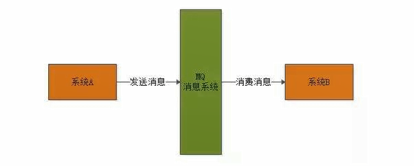

这样的一种通信方式，就是所谓的“异步”通信方式：对于系统A来说，只要把消息发送给MQ即可，然后系统B就会异步的去处理这条消息，系统A并**不需要“同步”的等待**系统B处理完。

系统间的解耦：① 发送者和接收者不必了解对方，只需要确认消息；② 发送者和接收者不必同时在线。

## 二、能干嘛

解耦、削峰、异步。

- 解耦：通过中间人将A、B系统业务调用分离，降低代码耦合度；

- 削峰：流量被中间人接管，降低消费者系统负担；

- 异步：不阻塞生产者（A）系统运行，待消费者（B）系统收到消息处理完毕后，通知生产者回调；

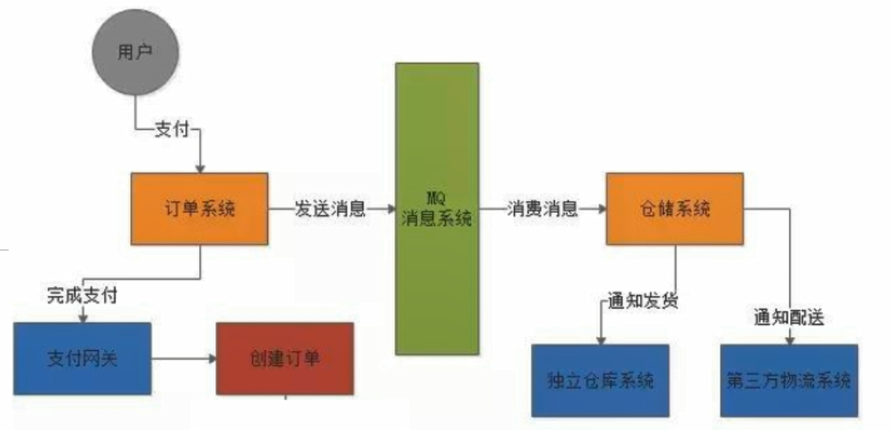

## 三、安装使用

官网：https://activemq.apache.org/

版本区别：

- ActiveMQ "Classic": Long established, endlessly pluggable architecture serving many generations of applications.

- ActiveMQ Artemis: High-performance, non-blocking architecture for the next generation of messaging applications.

安装 apache-activemq-5.16.3-bin.tar.gz：

```bash
# 文件路径
/opt/apache-activemq-5.16.3-bin.tar.gz
# 解压
tar -zxf apache-activemq-5.16.3-bin.tar.gz -C /activemq
# 普通启动
./bin/activemq start
# 输出日志
./bin/activemq start > active.log
# 监听
vi ./conf/jetty.xml
# jettyPort: host: 127.0.0.1 -> 0.0.0.0
```

端口：

- 61616：JMS
- 8161：管理控制台

## 四、MQ标准API

目的地：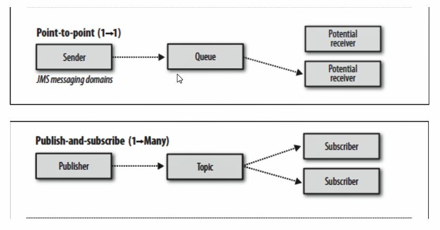

队列（queue）：在**点对点**的消息传递域中

主题（topic）：在**发布订阅**消息传递域中

### 4.1 队列

#### 4.1.1 生产者

```java
/**
 * -DAMQ_HOST=10.10.10.103
 */
public static void main(String[] args) throws JMSException {
    // 1. 创建连接工厂，使用默认用户名和密码
    ConnectionFactory connectionFactory = new ActiveMQConnectionFactory();
    // 2. 获取连接
    Connection connection = connectionFactory.createConnection();
    // 启动
    connection.start();

    // 3. 创建会话，参数1：事务，参数2：ACK签收
    Session session = connection.createSession(false, Session.AUTO_ACKNOWLEDGE);
    // 4. 目的地（队列/主题）
    Queue queue = session.createQueue(QUEUE_NAME);

    // 5. 创建生产者
    MessageProducer producer = session.createProducer(queue);
    TextMessage textMessage;
    for (int i = 0; i < 3; i++) {
        textMessage = session.createTextMessage("Deemo Message " + i);
        producer.send(textMessage);
    }

    // 关闭资源
    producer.close();
    session.close();
    connection.close();

    System.out.println("End.");
}
```

此时MQ服务器状态：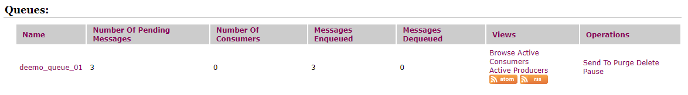

| Title                      | Desc               | Remark                          |
| -------------------------- | ------------------ | ------------------------------- |
| Number Of Pending Messages | 等待消费的消息数量 | 未出队列的数量，等于进队 - 出队 |
| Number Of Consumers        | 消费者数量         | 消费者端的消费者数量            |
| Messages Enqueued          | 进队消息数量       | 进入队列的消息总数量，只增不减  |
| Messages Dequeued          | 出队消息数量       | 消费者已消费的消息数量          |

#### 4.1.2 消费者

1. receive 阻塞

   ```java
   private static final String QUEUE_NAME = "deemo_queue_01";
   
   /**
    * -DAMQ_HOST=10.10.10.103
    */
   public static void main(String[] args) throws JMSException {
       // 1. 创建连接工厂，使用默认用户名和密码
       ConnectionFactory connectionFactory = new ActiveMQConnectionFactory();
       // 2. 获取连接
       Connection connection = connectionFactory.createConnection();
       // 启动
       connection.start();
   
       // 3. 创建会话，参数1：事务，参数2：ACK签收
       Session session = connection.createSession(false, Session.AUTO_ACKNOWLEDGE);
       // 4. 目的地（队列/主题）
       Queue queue = session.createQueue(QUEUE_NAME);
   
       // 5. 创建生产者
       MessageConsumer consumer = session.createConsumer(queue);
       Message message;
       while (true) {
           message = consumer.receive();
           // 暂时未搞懂有啥用，不按字面理解出牌
           // message = consumer.receiveNoWait();
           if (message == null) {
               break;
           }
   
           System.out.println("Receive: " + ((TextMessage) message).getText());
       }
   
       // 关闭资源
       consumer.close();
       session.close();
       connection.close();
   
       System.out.println("End.");
   }
   ```

   **同步阻塞式**，关于 `consumer.receive`：

   - 不传参时，一直阻塞直到收到消息
   - 传参最大等待时间（`Long`）：最大等待时间，超过即结束
   - `consumer.receiveNoWait()`：<font style="color: red;">**暂时未搞懂有啥用，不按字面理解出牌**</font>

2. messageListener 回调

   ```java
   private static final String QUEUE_NAME = "deemo_queue_01";
   
   /**
    * -DAMQ_HOST=10.10.10.103
    */
   public static void main(String[] args) throws JMSException, IOException {
       // 1. 创建连接工厂，使用默认用户名和密码
       ConnectionFactory connectionFactory = new ActiveMQConnectionFactory();
       // 2. 获取连接
       Connection connection = connectionFactory.createConnection();
       // 启动
       connection.start();
   
       // 3. 创建会话，参数1：事务，参数2：ACK签收
       Session session = connection.createSession(false, Session.AUTO_ACKNOWLEDGE);
       // 4. 目的地（队列/主题）
       Queue queue = session.createQueue(QUEUE_NAME);
   
       // 5. 创建生产者
       MessageConsumer consumer = session.createConsumer(queue);
       consumer.setMessageListener(message -> {
           if (message instanceof TextMessage) {
               try {
                   System.out.println("Receive: " + ((TextMessage) message).getText());
               } catch (JMSException e) {
                   e.printStackTrace();
               }
           }
       });
   
       // 防止提前终结进程运行
       System.in.read();
   
       // 关闭资源
       consumer.close();
       session.close();
       connection.close();
   
       System.out.println("End.");
   }
   ```

   **注册异步回调**。

此时MQ服务器状态：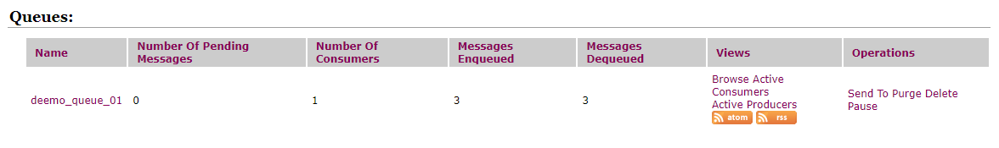

#### 4.1.3 消费者三大情况

1. 先生产，启动一号消费者，再启动二号消费者，二号消费者能收到消息吗？

   不能。

2. 先启动两个消费者，再生产3/6条消息，消费情况如何？

   - 各3/6条 ×
   - 先到先得 ×
   - 一人一半（负载） √

#### 4.1.4 队列总结

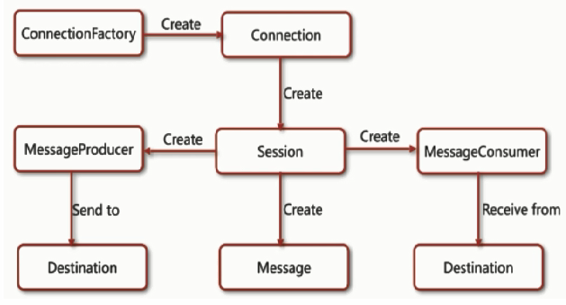

JMS开发步骤：

1. 创建Connection Factory
2. 通过Connection Factory创建JMS Connection
3. 通过JMS Connection创建JMS Session
4. 通过JMS Session创建JMS Destination
5. 创建JMS Producer/Consumer，并设置Destination
6. 如有需要，为JMS Consumer注册JMS Message Listener
7. 发送或接收消息
8. 关闭JMS资源（Connection、Session、Producer、Consumer等）

两种消费方式：

1. 同步阻塞：`receive`
2. 异步监听器：`messageListener`

点对点消息传递域特点：

1. **每个消息只能有一个消费者**，类似1对1的关系
2. 消息的生产者和消费者之间**没有时间上的相关性**。无论消费者在生产者发送消息时是否处于运行状态，消费者都可以提取消息，类似与发短信。
3. 消息被消费后队列中**不会再存储**，所以消费者不会消费到已经被消费掉的消息。

### 4.2 主题

发布订阅的消息传递域特点：

1. 生产者将消息发布到Topic中，每个消息可以有多个消费者，属于1 : N的关系
2. 生产者和消费者之间**有时间上的相关性**。订阅某一个主题的消费者**只能消费自它订阅后发布的消息**。
3. 生产者生产消息时，**Topic不保存消息**，它是无状态不落地的，假如无人订阅，那么它发布的消息就将是一条废弃的消息，所以一般先启动消费者再启动生产者。

JMS规范允许客户创建**持久订阅**。这在一定程度上放松了时间上的相关性要求。**持久订阅允许消费者消费它在未处于激活状态时生产者生产的消息。**

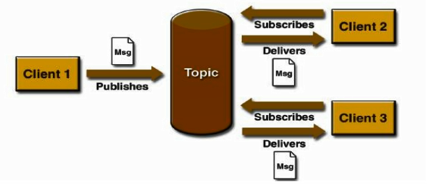

#### 4.2.1 生产者

```java
private static final String TOPIC_NAME = "deemo_topic_01";

/**
 * -DAMQ_HOST=10.10.10.103
 */
public static void main(String[] args) throws JMSException {
    // 1. 创建连接工厂，使用默认用户名和密码
    ConnectionFactory connectionFactory = new ActiveMQConnectionFactory();
    // 2. 获取连接
    Connection connection = connectionFactory.createConnection();
    // 启动
    connection.start();

    // 3. 创建会话，参数1：事务，参数2：ACK签收
    Session session = connection.createSession(false, Session.AUTO_ACKNOWLEDGE);
    // 4. 目的地（队列/主题）
    Topic topic = session.createTopic(TOPIC_NAME);

    // 5. 创建生产者
    MessageProducer producer = session.createProducer(topic);
    TextMessage textMessage;
    for (int i = 0; i < 3; i++) {
        textMessage = session.createTextMessage("Deemo Message " + i);
        producer.send(textMessage);
    }

    // 关闭资源
    producer.close();
    session.close();
    connection.close();

    System.out.println("End.");
}
```

#### 4.2.2 消费者

```java
private static final String TOPIC_NAME = "deemo_topic_01";

/**
 * -DAMQ_HOST=10.10.10.103
 */
public static void main(String[] args) throws JMSException, IOException {
    // 1. 创建连接工厂，使用默认用户名和密码
    ConnectionFactory connectionFactory = new ActiveMQConnectionFactory();
    // 2. 获取连接
    Connection connection = connectionFactory.createConnection();
    // 启动
    connection.start();

    // 3. 创建会话，参数1：事务，参数2：ACK签收
    Session session = connection.createSession(false, Session.AUTO_ACKNOWLEDGE);
    // 4. 目的地（队列/主题）
    Topic topic = session.createTopic(TOPIC_NAME);

    // 5. 创建生产者
    MessageConsumer consumer = session.createConsumer(topic);
    consumer.setMessageListener(message -> {
        if (message instanceof TextMessage) {
            try {
                System.out.println("Receive: " + ((TextMessage) message).getText());
            } catch (JMSException e) {
                e.printStackTrace();
            }
        }
    });

    System.in.read();

    // 关闭资源
    consumer.close();
    session.close();
    connection.close();

    System.out.println("End.");
}
```

#### 4.2.3 消费状态


### 4.3 对比

| #          | 队列                                                         | 主题                                                         |
| ---------- | ------------------------------------------------------------ | ------------------------------------------------------------ |
| 工作模式   | “负载均衡”模式，如果当前没有消费者，消息也不会丢失；如果有多个消费者，一条消息也只会被一个消费者消费，并且要求消费者ACK消息。 | “订阅-发布”模式。消息只会被订阅者消费，如果当前没有消费者，那么消息将被丢弃。 |
| 有无状态   | 队列数据默认会在MQ服务器上以文件形式保存，比如Active MQ一般保存在\$AMQ_HOME$/data/kr-store/data下，也可以配置为DB存储。 | 无状态。                                                     |
| 传递完整性 | 消息不会被丢弃。                                             | 如果没有消费者，消息将会被丢弃。                             |
| 处理效率   | 由于一条消息只会发送给一个消费者，所以就算消费者再多，性能也不会明显降低，单需要考虑不同消息协议的具体性能。 | 由于消息需要按照订阅者数量进行复制，所以处理性能会随着订阅者的增加而明显降低，并且还要结合不同消息协议自身的性能差异。 |

## 五、JMS是什么？

### 5.1 聊聊JavaEE

**JavaEE是一套使用Java进行企业级应用开发的大家一致遵循的13个核心规范工业标准。**JavaEE平台提供了一个基于**组件**的方法来加快设计、开发、装配及部署企业应用程序。

1. JDBC（Java Database）数据库连接
2. JNDI（Java Naming and Directory Interfaces）Java的命名和目录接口
3. EJB（Enterprise JavaBean）
4. RMI（Remote Method Invoke）远程方法调用
5. Java IDL（Interface Description Language）/CORBA（Common Object Broker Architecture）接口定义语言/公用对象请求代理程序体系结构
6. JSP（Java Server Pages）
7. Servlet
8. XML（Extensible Markup Language）可扩展白标记语言
9. **JMS（Java Message Service）Java消息服务**
10. JTA（Java Transaction API）Java事务API
11. JTS（Java Transaction Service）Java事务服务
12. JavaMail
13. JAF（JavaBean Activation Framework）

### 5.2 再说JMS

> Java Message Service - Java消息服务是JavaEE中的一个技术。

什么是Java消息服务？

Java消息服务指的是**两个应用程序之间进行*异步通信*的API**，它为标准消息协议和消息服务提供了一组通用接口，包括创建、发送、读取消息等，用于支持Java应用程序开发。在**JavaEE**中，当两个应用程序使用JMS进行通信时，它们之间**并不是直接相连**的，而是通过一个共同的消息收发服务组件关联起来以达到**解耦/异步削峰**的效果。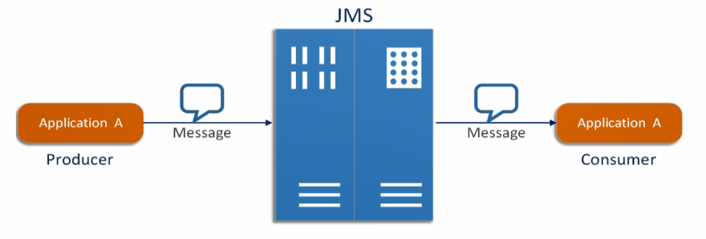

### 5.3 中间件落地产品

| 特性               | Active MQ      | Rabbit MQ（erlang） | Kafka            | Rocket MQ（Ali） |
| ------------------ | -------------- | ------------------- | ---------------- | ---------------- |
| PPRODUCER-COMSUMER | 支持           | 支持                | 支持             | 支持             |
| PUBLISH-SUBSCRIBE  | 支持           | 支持                | 支持             | 支持             |
| REQUEST-REPLAY     | 支持           | 支持                | *                | 支持             |
| API完备性          | 高             | 高                  | 高               | 低（静态配置）   |
| 多语言支持         | 支持，Java优先 | 语言无关            | 支持，Java优先   | 支持             |
| **单机吞吐量**     | 万级           | 万级                | 十万级           | 单机万级         |
| 消息延迟           | *              | 微秒级              | 毫秒级           | *                |
| 可用性             | 高（主从）     | 高（主从）          | 非常高（分布式） | 高               |
| 消息丢失           | *              | 低                  | 理论上不会丢失   | *                |
| 消息重复           | *              | 可控制              | 理论上会有重复   | *                |
| 文档完备性         | 高             | 高                  | 高               | 中               |
| 提供快速入门       | 有             | 有                  | 有               | 无               |
| 首次部署难度       | *              | 低                  | 中               | 高               |

### 5.4 JMS组成结构和特点

#### 5.4.1 JMS Provider

实现JMS接口和规范的消息中间件，也就是我们的MQ服务器

#### 5.4.2 JMS Producer

消息生产者，创建和发送JMS消息的客户端应用

#### 5.4.3 JMS Consumer

消息消费者，接收和处理JMS消息的客户端应用

#### 5.4.4 JMS Message

##### 5.4.4.1 消息头

- JMS Destination

  消息发送的目的地，主要是指Queue和Topic。

- **JMS DeliverMode**

  持久和非持久模式。

  一条持久性的消息：应该被传送“一次且仅一次”，这就意味着如果JMS提供者出现故障，**该消息并不会丢失**，他会在服务器恢复之后再次传递。

  一条非持久的消息：最多会传递一次，这就意味着当服务器出现故障时，**该消息将会永远丢失**。

- JMS Expiration

  TTL，消息过期时间，**默认是永不过期**。

  消息过期时间等于Destination的 `send()` 方法中 `timeToLive` 值加上发送时刻的GMT时间值。

  如果 `timeToLive` 值等于零，则JMS Expiration被设置为零，表示消息永不过期；如果在消息发送后，在消息过期时间之后消息还没有被发送到目的地，则该消息被清除。

- JMS Priority

  消息优先级，**从0-9共是个级别，0到4是普通消息，5-9是加急消息**。**默认是4级**。

  JMS**不要求**MQ严格按照这是个优先级发送消息，但必须**保证加急消息要先于普通消息**到达。

- **JMS MessageID**

  **唯一识别**每个消息的标识，**默认由MQ产生**。

- ......

##### 5.4.4.2 消息体

消息体用于封装具体的消息数据，共有**五种**消息体格式，并且**发送和接收的消息体类型必须一致**对应。

- **TextMessage**

  普通字符串消息，包含一个 `String`。

- **MapMessage**

  一个 `Map` 类型的消息，key为 `String` 类型，而值为**Java的基本类型**。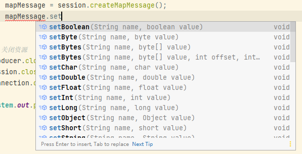

- BytesMessage

  二进制数组消息，包含一个 `byte[]`。

- StreamMessage

  Java数据流消息，用标准流操作来顺序的填充和读取。

- ObjectMessage

  对象消息，包含一个**可序列化**的Java对象。

##### 5.4.4.3 消息属性

对消息的额外扩展补充：如果需要除消息头字段以外的值，那么可以使用消息属性；是一个用于*识别/去重/重点标注*消息的非常有用的方法。

它们是以**属性名-属性值键值对**形式制定的，可以将属性**视为消息头的扩展**，属性指定一些消息头没有包括的附加信息，比如可以在消息属性中指定消息选择器。消息的属性就像可以分配给一条消息的附加信息头一样，它们允许开发者添加有关消息的不透明附加信息；它们还用于暴露消息选择器在消息过滤时使用的数据。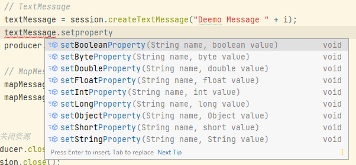

## 六、***消息可靠性

### 6.1 持久化

- 持久化

  `producer.setDeliveryMode(DeliveryMode.PERSISTENT);`

  服务器宕机（重启后Messages Enqueued会清零）后，消息仍然存在。

- 非持久化

  `producer.setDeliveryMode(DeliveryMode.NON_PERSISTENT);`

  服务器宕机后，消息就不存在了。

#### 6.1.1 队列

**队列默认为持久化模式**，此模式保证这些消息只被传送一次和成功使用一次，消息服务在向消费者传送消息前不会丢失这些消息。

#### 6.1.2 主题订阅

**主题订阅需要先启动订阅再启动生产**，类似于微信公众号订阅发布，需要先订阅，后续就算关机后再开机也能收到消息。

- 生产者

  ```java
  private static final String TOPIC_NAME = "deemo_topic_persist_01";
  
  /**
   * -DAMQ_HOST=10.10.10.103
   */
  public static void main(String[] args) throws JMSException {
      // 1. 创建连接工厂，使用默认用户名和密码
      ConnectionFactory connectionFactory = new ActiveMQConnectionFactory();
      // 2. 获取连接
      Connection connection = connectionFactory.createConnection();
      // 启动
      connection.start();
  
      // 3. 创建会话，参数1：事务，参数2：ACK签收
      Session session = connection.createSession(false, Session.AUTO_ACKNOWLEDGE);
      // 4. 目的地（队列/主题）
      Topic topic = session.createTopic(TOPIC_NAME);
  
      // 5. 创建生产者
      MessageProducer producer = session.createProducer(topic);
      // 持久化
      producer.setDeliveryMode(DeliveryMode.PERSISTENT);
  
      TextMessage textMessage;
      for (int i = 0; i < 3; i++) {
          textMessage = session.createTextMessage("Deemo Message " + i);
          producer.send(textMessage);
      }
  
      // 关闭资源
      producer.close();
      session.close();
      connection.close();
  
      System.out.println("End.");
  }

- 消费者

  ```java
  private static final String TOPIC_NAME = "deemo_topic_persist_01";
  
  /**
   * -DAMQ_HOST=10.10.10.103
   */
  public static void main(String[] args) throws JMSException, IOException {
      // 1. 创建连接工厂，使用默认用户名和密码
      ConnectionFactory connectionFactory = new ActiveMQConnectionFactory();
      // 2. 获取连接
      Connection connection = connectionFactory.createConnection();
      // 订阅模式，需要指定ID
      connection.setClientID("deemo_topic_consumer_01");
      // 启动
      connection.start();
  
      // 3. 创建会话，参数1：事务，参数2：ACK签收
      Session session = connection.createSession(false, Session.AUTO_ACKNOWLEDGE);
      // 4. 目的地（队列/主题）
      Topic topic = session.createTopic(TOPIC_NAME);
  
      // 5. 创建订阅生产者
      TopicSubscriber topicSubscriber = session.createDurableSubscriber(topic, "remark...");
  
      // receive
      Message message = topicSubscriber.receive();
      while (message != null) {
          System.out.println("Receive: " + ((TextMessage) message).getText());
  
          message = topicSubscriber.receive(2000L);
      }
  
      // topicSubscriber.setMessageListener(message -> {
      //     if (message instanceof TextMessage) {
      //         try {
      //             System.out.println("Receive: " + ((TextMessage) message).getText());
      //         } catch (JMSException e) {
      //             e.printStackTrace();
      //         }
      //     }
      // });
      // System.in.read();
  
      // 关闭资源
      topicSubscriber.close();
      session.close();
      connection.close();
  
      System.out.println("End.");
  }

### 6.2 事务

> 事务偏生产者、签收偏消费者。

- 生产者

  开启事务时，消息在 `send()` 后，需要主动 `session.commit()`。

  ```java
  private static final String QUEUE_NAME = "deemo_tx_queue_01";
  
  /**
   * -DAMQ_HOST=10.10.10.103
   */
  public static void main(String[] args) throws JMSException {
      // 1. 创建连接工厂，使用默认用户名和密码
      ConnectionFactory connectionFactory = new ActiveMQConnectionFactory();
      // 2. 获取连接
      Connection connection = connectionFactory.createConnection();
      // 启动
      connection.start();
  
      // 3. 创建会话、开启事务
      Session session = connection.createSession(true, Session.SESSION_TRANSACTED);
      // 4. 目的地（队列/主题）
      Queue queue = session.createQueue(QUEUE_NAME);
  
      // 5. 创建生产者
      MessageProducer producer = session.createProducer(queue);
  
      // 非持久化
      producer.setDeliveryMode(DeliveryMode.NON_PERSISTENT);
      // 持久化
      producer.setDeliveryMode(DeliveryMode.PERSISTENT);
  
      for (int i = 0; i < 3; i++) {
          // TextMessage
          producer.send(session.createTextMessage("Deemo TX Message " + i));
      }
      // 开启事务下，需要手动 commit
      session.commit();
  
      // 关闭资源
      producer.close();
      session.close();
      connection.close();
  
      System.out.println("End.");
  }
  ```

  注：`connection.createSession(true, Session.SESSION_TRANSACTED);`，对生产者而言，当开启事务时，第二个ACK签收参数就不那么重要了，`commit` 优先级更高一些。

  为什么需要事务，麻烦的手动 `commit` 一次？

  答：当前演示为简单案例，仅有一个简单消息提交，但是当处于复杂的系统业务时，业务场景很有可能是：**一批量消息要么同时成功提交、要么同时失败**，类似于数据库事务。

- 消费者

  消费者开启事务时，同样需要主动 `session.commit()` **防止重复消费**。

  ```java
  private static final String QUEUE_NAME = "deemo_tx_queue_01";
  
  /**
   * -DAMQ_HOST=10.10.10.103
   */
  public static void main(String[] args) throws JMSException, IOException {
      // 1. 创建连接工厂，使用默认用户名和密码
      ConnectionFactory connectionFactory = new ActiveMQConnectionFactory();
      // 2. 获取连接
      Connection connection = connectionFactory.createConnection();
      // 启动
      connection.start();
  
      // 3. 创建会话，开启事务
      Session session = connection.createSession(true, Session.AUTO_ACKNOWLEDGE);
      // 4. 目的地（队列/主题）
      Queue queue = session.createQueue(QUEUE_NAME);
  
      // 5. 创建生产者
      MessageConsumer consumer = session.createConsumer(queue);
  
      // receive
      Message message;
      while (true) {
          message = consumer.receive(4000L);
          if (message == null) {
              break;
          }
  
          System.out.println("Receive: " + ((TextMessage) message).getText());
          // 开启事务时，需要手动 commit，防止重复消费
          session.commit();
      }
  
      // 关闭资源
      consumer.close();
      session.close();
      connection.close();
  
      System.out.println("End.");
  }
  ```

### 6.3 签收

> 事务偏生产者、签收偏消费者。

#### 6.3.1 `AUTO_ACKNOWLEDGE`

`Session.AUTO_ACKNOWLEDGE`：自动签收**（默认）**。

#### 6.3.2 `CLIENT_ACKNOWLEDGE`

`Session.CLIENT_ACKNOWLEDGE`：手动签收。

##### 6.3.2.1 非事务

```java
Session session = connection.createSession(false, Session.CLIENT_ACKNOWLEDGE);

// ...

Message message;
while (true) {
    message = consumer.receive(4000L);
    if (message == null) {
        break;
    }

    System.out.println("Receive: " + ((TextMessage) message).getText());
    // 未开启事务时，手动确认签收
    message.acknowledge();
}
```

**未开启事务时，手动确认签收：`message.acknowledge();`。**

##### 6.3.2.2 事务

```java
Session session = connection.createSession(true, Session.CLIENT_ACKNOWLEDGE);

// ...

Message message;
while (true) {
    message = consumer.receive(4000L);
    if (message == null) {
        break;
    }

    System.out.println("Receive: " + ((TextMessage) message).getText());
    // 开启事务时，手动确认签收无意义
    // message.acknowledge();
    // 开启事务时，必须需要手动 commit，防止重复消费
    session.commit();
}
```

注：开启事务且是手动签收模式时，如果仅仅 `message.acknowledge();` 将会导致重复消费的问题出现！也正是<font style="color: red;">**开启事务时，必须主动 `session.commit()`**</font>，此时，不管是什么应答模式，都将自动签收，也就是说就算是手动签收模式，也不再需要 `message.acknowledge();`。也说明了，**事务优先级高于签收**。

#### 6.3.3 `DUPS_OK_ACKNOWLEDGE`

`Session.DUPS_OK_ACKNOWLEDGE`：允许重复消息，使用较少，了解使用。

### 6.4 事务与签收关系

在事务型会话中，当一个事务被成功提交则消息**被自动签收**。如果事务回滚，则消息会被再次传送。

在非事务型会话中，消息何时被确认**取决于**创建会话时指定的**应答模式**（`acknowledgeMode`）。

### 6.5 点对点、发布订阅小总结

#### 6.5.1 点对点

点对点模型是基于**队列**的，生产者生产消息到队列，消费者从高队列消费消息。队列的存在使得消息的**异步传输**成为可能，类似于生活中的发短信。

1. 如果在Session关闭时有部分消息已接收到但还没有被签收（`acknowledgeMode`），那么当消费者下次连接到相同的队列时，这些消息将被**再次**接收消费；
2. **队列可以长久地保存消息直到被消费者消费**。消费者无需因为担心丢失消息而时刻和队列保持激活的连接状态，充分体现了**异步传输模式**的优势。

#### 6.5.2 发布订阅

JMS Pub/Sub模型定义了如何向一个内容节点发布和订阅消息，这些节点被称作Topic。

主题可以被认为是消息的传输中介，发布者（Publisher）发布消息到主题，订阅者（Subscribe）从主题订阅消息。主题使得消息订阅者和消息发布者保持互相独立，不需要接触即可保证消息的传送。

- 非持久订阅

  非持久订阅只有当消费者处于**激活状态**（与MQ保持连接）时**才能**收到生产者发送到某个主题的消息。如果消费者处于离线状态，那么此时生产者发送的主题消息将会丢失作废、不会被消费。

- 持久订阅

  消费者首先向MQ注册一个自己的身份ID识别号（`ClientID`），此后，**无论该消费者是激活状态还是离线状态，都会接收到自注册后生产者发送到主题的所有消息**，即消费者离线时生产者生产的消息会在消费者重新激活时收到所有自自己离线时生产者送到主题的所有消息。

<font style="color: red;">**非持久订阅状态下，不能恢复或重新派送一个未签收的消息。**</font>

<font style="color: red;">**持久订阅状态下，才能恢复或重新派送一个未签收的消息。**</font>

## 七、Boker

### 7.1 是什么？

Broker相当于一个Active MQ服务器实例。简单来说，Boker就是实现了用代码的形式启动Active MQ，将MQ嵌入到Java代码中以便随时用、随时启动，在使用的时候再去启动能更节省资源，也保证了可靠性。

### 7.2 指定.conf配置文件

```bash
./activemq start xbean:file:/data/conf/activemq/activemq.xml
```

### 7.3 嵌入式Broker

用Active Broker作为独立的消息服务器来构建Java应用，Active MQ支持在vm中通信基于嵌入式的Broker，能够无缝的集成其他Java应用。

```java
public static void main(String[] args) throws Exception {
    BrokerService brokerService = new BrokerService();
    brokerService.setUseJmx(true);
    brokerService.addConnector("tcp://localhost:61616");
    brokerService.start();
    
    System.in.read();
}
```

## 八、整合

### 8.1 Spring

#### 8.1.1 pom.xml

```xml
<properties>
    <java.version>1.8</java.version>

    <spring.version>4.3.12.RELEASE</spring.version>
    <activemq.version>5.15.9</activemq.version>
    <jackson.version>2.12.5</jackson.version>
</properties>

<!-- Spring -->
<dependencies>
    <dependency>
        <groupId>org.springframework</groupId>
        <artifactId>spring-jms</artifactId>
        <version>${spring.version}</version>
    </dependency>
    <dependency>
        <groupId>org.springframework</groupId>
        <artifactId>spring-context-support</artifactId>
        <version>${spring.version}</version>
    </dependency>

    <dependency>
        <groupId>org.apache.activemq</groupId>
        <artifactId>activemq-all</artifactId>
        <version>${activemq.version}</version>
    </dependency>
    <dependency>
        <groupId>org.apache.activemq</groupId>
        <artifactId>activemq-pool</artifactId>
        <version>${activemq.version}</version>
    </dependency>

    <dependency>
        <groupId>com.fasterxml.jackson.core</groupId>
        <artifactId>jackson-databind</artifactId>
        <version>${jackson.version}</version>
    </dependency>
</dependencies>
```

#### 8.1.2 applicationContext.xml

```xml
<?xml version="1.0" encoding="UTF-8"?>
<beans xmlns="http://www.springframework.org/schema/beans"
       xmlns:xsi="http://www.w3.org/2001/XMLSchema-instance"
       xmlns:context="http://www.springframework.org/schema/context"
       xsi:schemaLocation="http://www.springframework.org/schema/beans http://www.springframework.org/schema/beans/spring-beans.xsd
        http://www.springframework.org/schema/context http://www.springframework.org/schema/context/spring-context.xsd">

    <!-- 包扫描 -->
    <context:component-scan base-package="com.deemo.mq.spring" />

    <!--  -->
    <bean id="jmsFactory" class="org.apache.activemq.pool.PooledConnectionFactory" destroy-method="stop">
        <property name="connectionFactory">
            <!-- ConnectionFactory实现 -->
            <bean class="org.apache.activemq.ActiveMQConnectionFactory">
                <property name="brokerURL" value="tcp://10.10.10.103:61616" />
            </bean>
        </property>
        <property name="maxConnections" value="100" />
    </bean>

    <!-- 目的地 -->
    <bean id="destinationQueue" class="org.apache.activemq.command.ActiveMQQueue">
        <constructor-arg index="0" value="spring_deemo_queue" />
    </bean>
    
    <!-- 目的地 -->
    <bean id="destinationTopic" class="org.apache.activemq.command.ActiveMQTopic">
        <constructor-arg index="0" value="spring_deemo_topic" />
    </bean>

    <!-- Spring 提供的JMS工具类，可以进行消息发送、接收等 -->
    <bean id="jmsTemplate" class="org.springframework.jms.core.JmsTemplate">
        <property name="connectionFactory" ref="jmsFactory" />
        <!-- 切换目的地 -->
        <property name="defaultDestination" ref="destinationQueue" />
        <!--<property name="defaultDestination" ref="destinationTopic" />-->
        <property name="messageConverter">
            <bean class="org.springframework.jms.support.converter.SimpleMessageConverter" />
        </property>
    </bean>

</beans>
```

#### 8.1.3 生产者

```java
@Service
public class JmsSpringProduce {

    @Autowired
    private JmsTemplate jmsTemplate;

    public static void main(String[] args) {
        ApplicationContext applicationContext = new 
            ClassPathXmlApplicationContext("applicationContext.xml");
        JmsSpringProduce produce = 
            applicationContext.getBean(JmsSpringProduce.class);

        produce.jmsTemplate.send(session -> session.createTextMessage("spring-deemo-text"));

        System.out.println("End.");
    }
}
```

#### 8.1.4 消费者

```java
@Service
public class JmsSpringConsumer {

    @Autowired
    private JmsTemplate jmsTemplate;

    public static void main(String[] args) throws JMSException {
        ApplicationContext applicationContext = 
            new ClassPathXmlApplicationContext("applicationContext.xml");
        JmsSpringConsumer consumer = 
            applicationContext.getBean(JmsSpringConsumer.class);

        // String text = (String) consumer.jmsTemplate.receiveAndConvert();
        TextMessage message;
        while(true) {
            message = (TextMessage) consumer.jmsTemplate.receive();
            if (message == null) {
                break;
            }

            System.out.println("Spring consumer receive: " + message.getText());
        }

        System.out.println("End.");
    }
}
```

#### 8.1.5 队列、主题

在 `applicationContext.xml` 配置文件中切换目的地即可。

#### 8.1.6 监听器

##### 8.1.6.1 applicationContext.xml

```xml
<!-- 监听器 -->
<!--<bean id="deemoMessageListener" class="com.deemo.mq.spring.DeemoMessageListener" />-->

<!-- 配置监听器，方式一 -->
<bean id="jmsContainer" class="org.springframework.jms.listener.DefaultMessageListenerContainer">
    <property name="connectionFactory" ref="jmsFactory" />
    <property name="destination" ref="destinationTopic" />
    <property name="messageListener" ref="deemoMessageListener" />
</bean>

<!-- 配置监听器，方式二 -->
<!--<jms:listener-container container-type="default" connection-factory="jmsFactory" acknowledge="auto">
    &lt;!&ndash; destination为目的地的名称 &ndash;&gt;
    <jms:listener destination="spring_deemo_queue" ref="deemoMessageListener" />
</jms:listener-container>-->
```

注：`jms:listener` 中，destination为目的地的名称。

##### 8.1.6.2 MessageListener

```java
@Component
public class DeemoMessageListener implements MessageListener {
    @Override
    public void onMessage(Message message) {
        try {
            if (message instanceof TextMessage) {
                System.out.println("DeemoMessageListener onMessage: " 
                                   + ((TextMessage) message).getText());
                return;
            }

            System.out.println(message.getJMSType());
        } catch (JMSException e) {
            e.printStackTrace();
        }
    }
}
```

##### 8.1.6.3 生产者

```java
@Service
public class JmsSpringTopicProduce {

    @Autowired
    private JmsTemplate jmsTemplate;

    public static void main(String[] args) {
        ApplicationContext applicationContext = new 
            ClassPathXmlApplicationContext("applicationContext.xml");
        JmsSpringTopicProduce produce = applicationContext.getBean(JmsSpringTopicProduce.class);

        produce.jmsTemplate.send(session -> session.createTextMessage("spring-deemo-topic-text"));

        System.out.println("End.");
    }
}
```

此时**只需要启动生产者，不需要启动消费者**，将**自动**调用 `DeemoMessageListener#onMessage()` 消费消息。

### 8.2 Spring Boot

#### 8.2.1 pom.xml

```xml
<parent>
    <groupId>org.springframework.boot</groupId>
    <artifactId>spring-boot-starter-parent</artifactId>
    <version>2.5.4</version>
    <relativePath/> <!-- lookup parent from repository -->
</parent>

<!-- Spring Boot-->
<dependencies>
    <dependency>
        <groupId>org.springframework.boot</groupId>
        <artifactId>spring-boot-starter-activemq</artifactId>
    </dependency>
    <dependency>
        <groupId>org.apache.activemq</groupId>
        <artifactId>activemq-kahadb-store</artifactId>
        <scope>runtime</scope>
    </dependency>
    <!--<dependency>
        <groupId>org.springframework.boot</groupId>
        <artifactId>spring-boot-starter-artemis</artifactId>
    </dependency>-->
    <dependency>
        <groupId>org.springframework.boot</groupId>
        <artifactId>spring-boot-starter-integration</artifactId>
    </dependency>
    <dependency>
        <groupId>org.springframework.boot</groupId>
        <artifactId>spring-boot-starter-web</artifactId>
    </dependency>

    <dependency>
        <groupId>org.springframework.integration</groupId>
        <artifactId>spring-integration-http</artifactId>
    </dependency>
    <dependency>
        <groupId>org.springframework.integration</groupId>
        <artifactId>spring-integration-jms</artifactId>
    </dependency>

    <dependency>
        <groupId>mysql</groupId>
        <artifactId>mysql-connector-java</artifactId>
        <scope>runtime</scope>
    </dependency>
    <dependency>
        <groupId>org.projectlombok</groupId>
        <artifactId>lombok</artifactId>
        <optional>true</optional>
    </dependency>

    <dependency>
        <groupId>org.springframework.boot</groupId>
        <artifactId>spring-boot-starter-test</artifactId>
        <scope>test</scope>
    </dependency>
    <dependency>
        <groupId>org.springframework.integration</groupId>
        <artifactId>spring-integration-test</artifactId>
        <scope>test</scope>
    </dependency>
</dependencies>
```

#### 8.2.2 application.yml

```yaml
server:
  port: 8080

spring:
  activemq:
    broker-url: tcp://10.10.10.103:61616
    user: admin
    password: admin
  jms:
    pub-sub-domain: false # false: Queue true: Topic
    # pub-sub-domain: true # false: Queue true: Topic

# 自定义队列名称
deemo:
  queue: boot-deemo-queue
  topic: boot-deemo-topic
```

#### 8.2.3 Spring Boot Bean

##### 8.2.3.1 ConfigBean

```java
@Component
@EnableJms
public class ConfigBean {

    @Value("${deemo.queue}")
    private String DeemoQueue;

    @Value("${deemo.topic}")
    private String DeemoTopic;

    @Bean
    public Queue queue() {
        return new ActiveMQQueue(DeemoQueue);
    }

    @Bean
    public Topic topic() {
        return new ActiveMQTopic(DeemoTopic);
    }

}
```

注：`@EnableJms`。

##### 8.2.3.2 生产者

```java
@Service
public class JmsBootProduce {

    @Resource
    private JmsMessagingTemplate jmsMessagingTemplate;

    @Resource
    private Queue queue;
    
    @Resource
    private Topic topic;


    public void produce() {
        jmsMessagingTemplate.convertAndSend(queue, "Boot Deemo Message " + 
                                            UUID.randomUUID().toString().substring(0, 8));
        jmsMessagingTemplate.convertAndSend(topic, "Boot Deemo Topic Message " + 
                                            UUID.randomUUID().toString().substring(0, 8));
    }

}
```

##### 8.2.3.3 间隔定投

- 生产者

  ```java
  @Service
  public class JmsBootProduce {
  
      @Resource
      private JmsMessagingTemplate jmsMessagingTemplate;
  
      @Resource
      private Queue queue;
      
      @Resource
      private Topic topic;
      
  
      // 每三秒钟调用一次
      @Scheduled(fixedDelay = 3000)
      public void produceScheduled() {
          jmsMessagingTemplate.convertAndSend(queue, "Boot Deemo Scheduled Message " + 
                                              UUID.randomUUID().toString().substring(0, 8));
          jmsMessagingTemplate.convertAndSend(topic, "Boot Deemo Scheduled Topic Message " + 
                                              UUID.randomUUID().toString().substring(0, 8));
          System.out.println("Scheduled send End.");
      }
  
  }
  ```

- 主启动类

  ```java
  @SpringBootApplication
  @EnableScheduling
  public class Boot03MqApplication {
  
  	public static void main(String[] args) {
  		SpringApplication.run(Boot03MqApplication.class, args);
  	}
  
  }
  ```

  注：`@EnableScheduling` 开启定时调用。

##### 8.2.3.4 消费者

```java
@Component
public class JmsBootConsumer {

    @JmsListener(destination = "${deemo.queue}")
    public void receive(TextMessage textMessage) throws JMSException {
        System.out.println("Boot Receive: " + textMessage.getText());
    }
    
}

@Component
public class JmsBootTopicConsumer {

    @JmsListener(destination = "${deemo.topic}")
    public void receive(TextMessage textMessage) throws JMSException {
        System.out.println("Boot Receive Topic: " + textMessage.getText());
    }
    
}
```

注：`@JmsListener(destination = "${deemo.queue}")`。

##### 8.2.3. 单元测试

```java
@SpringBootTest(classes = Boot03MqApplication.class)
@WebAppConfiguration
class Boot03MqApplicationTests {

	@Resource
	private JmsBootProduce jmsBootProduce;


	@Test
	void contextLoads() {

	}

	@Test
	public void testSend() {
		jmsBootProduce.produce();
	}

}
```

## 九、传输协议

> https://activemq.apache.org/configuring-version-5-transports

### 9.1 传输协议简介

Active MQ支持的client-broker通讯协议有：TCP、NIO、UDP、SSL、HTTP(S)、VM。

其中配置Transport Connector的文件在Active MQ安装目录的conf/activemq.xml中的\<transportConectors\>标签内：

```xml
<transportConnectors>
    <!-- DOS protection, limit concurrent connections to 1000 and frame size to 100MB -->
    <transportConnector name="openwire" uri="tcp://0.0.0.0:61616?maximumConnections=1000&amp;wireFormat.maxFrameSize=104857600"/>
    <transportConnector name="amqp" uri="amqp://0.0.0.0:5672?maximumConnections=1000&amp;wireFormat.maxFrameSize=104857600"/>
    <transportConnector name="stomp" uri="stomp://0.0.0.0:61613?maximumConnections=1000&amp;wireFormat.maxFrameSize=104857600"/>
    <transportConnector name="mqtt" uri="mqtt://0.0.0.0:1883?maximumConnections=1000&amp;wireFormat.maxFrameSize=104857600"/>
    <transportConnector name="ws" uri="ws://0.0.0.0:61614?maximumConnections=1000&amp;wireFormat.maxFrameSize=104857600"/>
</transportConnectors>
```

在上文给出的配置片段中，URI描述信息的头部都是采用协议名称：例如，

- `amqp` 协议：URI描述格式为：`amqp://...`
- `stomp` 协议：URI描述格式为：`stomp://...`
- 唯独在进行 `openwire` 协议描述时，URI头却是：`tcp://...`，**这是因为Active MQ中默认的消息协议就是 `openwire`。**

### 9.2 传输协议种类

#### 9.2.1 ***TCP（默认）

1. 默认的Broker配置，TCP的Client监听端口61616
2. 在网络传输数据前，必须要序列化数据，消息是通过一个叫wire protocol的来序列化成**字节流**。默认情况下Active MQ把wire protocol叫做 `opewire`，它的目的是促使网络上的效率和数据快速交互
3. TCP连接的URI格式：`tcp://hostame:port?ke1=value1&key2=value2`，参数可选
4. TCP传输优点：
   1. TCP协议传输可靠性高，稳定性强
   2. 高效性：字节流方式传递，效率很高
   3. 有效性、可用性：应用广泛、支持任何平台
5. 配置参考：`https://activemq.apache.org/tcp-transport-reference`

#### 9.2.2 ***NIO

1. NIO协议和TCP协议类似，但NIO更侧重于底层的访问操作。它允许开发人员对同一资源可有更多的Client调用和服务端有更多的负载
2. 适合使用NIO协议的场景：
   1. 可能有大量的Client去连接到Broker上，一般情况下，大量的Client去连接Broker是被操作系统的线程所限制的。因此，NIO的实现比TCP需要更少的线程去运行，所以建议使用NIO协议
   2. 可能对于Broker有一个很迟钝的网络传输，NIO比TCP提供更好的性能
3. NIO连接的URI格式：`nio://hostname:port?key=value`
4. 配置参考：`https://activemq.apache.org/nio-transport-reference`

#### 9.2.3 AMQP

Advanced Message Queuing Protocol，一个提供**统一消息服务**的应用层标准高级消息队列协议，是应用层协议的一个**开放标准**，为**面向消息的中间件设计**。

基于此协议的客户端与消息中间件可传递消息，并**不受客户端/中间件不同产品，不同开发语言等条件的限制**。

#### 9.2.4 stomp

Streaming Text Orientated Message Protocol，是**流文本定向消息协议**，是一种为MOM(Message Oriented Middleware，面向消息的中间件)设计的简单文本协议。

#### 9.2.5 SSL

1. The SSL transport allows clients to connect to a remote ActiveMQ broker **using SSL over a TCP socket**.
2. SSL连接的URI格式：`ssl://hostname:port?key=value`
3. 配置参考：`https://activemq.apache.org/ssl-transport-reference`

#### 9.2.6 mqtt

Message Queuing Telemetry Transport，消息队列遥测传输，是IBM开发的一个即时通讯协议，有可能成为物联网的重要组成部分。该协议支持所有平台，几乎可以把所有联网物品和外部连接起来，被用来当做传感器和致动器〈比如通过Twitter让房屋联网）的通信协议。

引用扩展：`https:/lgithub.com/fusesource/mqtt-client`

#### 9.2.7 ws

1. This transport uses the new **HTML5 WebSockets** to exchange messages with the broker.
2. 配置参考：`https://activemq.apache.org/websockets`

#### 9.2.8 总结

| 协议    | 描述                                                         |
| ------- | ------------------------------------------------------------ |
| TCP     | 默认的协议，性能相对可以                                     |
| NIO     | 基于TCP协议之上的，进行了扩展和优化，具有更好的扩展性        |
| UDP     | 性能比TCP更好，但是**不具有可靠性**                          |
| SSL     | 安全链接                                                     |
| HTTP(S) | HTTP(S)基于HTTP或者HTTPS                                     |
| VM      | VM本身不是协议，当客户端和代理在同一个Java虚拟机(VM)中运行时，他们之间需要通信，但不想占用网络通道，而是直接通信，可以使用该方式 |

### 9.3 NIO

**如果不指定Active MQ的网络监听端口，那么这些端口都将使用<font style="color: red;">BIO</font>网络模型。（opewire、AMQP、stomp...）**

#### 9.3.1 配置

```xml
<!-- conf/activemq.xml -->
<transportConnector name="nio" uri="nio://0.0.0.0:61618?maximumConnections=1000&amp;wireFormat.maxFrameSize=104857600"/>
```

#### 9.3.2 进一步优化

```java
private static final String ACTIVE_MQ_URI = "nio://xxx:61618";
```

**URI格式头以“nio”开头，表示这个端口使用以TCP协议为基础的NIO网络IO模型。**但是这样的设置方式，只能使这个端口支持 `opewire` 协议，如何让 `AMQP/stomp` 等协议也支持NIO？

#### 9.3.3 auto

> https://activemq.apache.org/auto
>
> Starting with version **5.13.0**, ActiveMQ supports wire format protocol detection.  OpenWire, STOMP, AMQP, and MQTT can be automatically detected.  This allows one transport to be shared for all 4 types of clients.

##### 9.3.3.1 配置

```xml
<transportConnector name="auto+nio" uri="auto+nio://localhost:61608?maximumConnections=1000&amp;wireFormat.maxFrameSize=104857600&amp;org.apache.activemq.transport.nio.SelectorManager.corePoolSize=20&amp;org.apache.activemq.transport.nio.SelectorManager.maximumPoolSize=50"/>
```

##### 9.3.3.2 URI

```java
// TCP
private static final String ACTIVE_MQ_URI = "tcp://xxx:61608";
// NIO
private static final String ACTIVE_MQ_URI = "nio://xxx:61608";
```

##### 9.3.3.3 配置支持的Wire Protocols

By default all wire protocols are available.  This can be configured to only enable certain formats by setting the property  `auto.protocols.` 

| Value   | Description          |
| ------- | -------------------- |
| default | Enables OpenWire     |
| amqp    | Enables AMQP format  |
| stomp   | Enables STOMP format |
| mqtt    | Enables MQTT format  |

An example showing only OpenWire and STOMP enabled:

```xml
<transportConnector name="auto" uri="auto://localhost:5671auto.protocols=default,stomp"/>
```

## 十、消息持久化

> https://activemq.apache.org/persistence

为了避免意外宕机以后丢失信息，需要做到重启后可以恢复消息队列，消息系统一般都会采用**持久化机制**。

Active MQ的消息持久化机制有：JDBC、AMQ、KahaDB和LevelDB，无论使用哪种持久化方式，消息的存储逻辑都是一致的：在生产者生产消息后，消息中心首先将信息存储到本地数据文件、内存数据库或者远程数据库等再试图将消息发送给消费者，**成功则将消息从存储中删除，失败则继续尝试发送**。消息中心启动以后首先检查指定的存储位置，如果有未发送成功的消息，则需要把消息发送出去。

<font style="color: red;">**一般来说，消息中心与持久化主机应不在同一台设备。**</font>

### 10.1 AMQ

> https://activemq.apache.org/amq-message-store
>
>  基于文件的存储方式，Active MQ V5.3以前版本的默认消息存储方式。

AMQ是一种文件存储形式，它具有写入速度快和容易恢复的特点。消息存储在一个个文件中，文件的默认大小为32M，当一个存储文件中的消息已经全部被消费时，这个文件将被标记为可删除，在下一个清除阶段，这个文件将会被删除。AMQ适用于Active MQ V5.3以前版本。

### 10.2 KahaDB

> https://activemq.apache.org/kahadb

#### 10.2.1 简介

KahaDB是一个**基于文件的持久性数据库**，它位于使用它的消息 Broker 本地。它已针对快速持久化进行了优化，是Active MQ V5.4是默认消息存储机制。KahaDB使用更少的文件描述符并提供比其前身AMQ更快的恢复能力。

```xml
<broker brokerName="broker">
    <persistenceAdapter>
      <kahaDB directory="${activemq.data}/kahadb" journalMaxFileLength="32mb"/>
    </persistenceAdapter>
</broker>
```

#### 10.2.2 存储原理

KahaDB是Active MQ V5.4默认消息存储机制，可用于任何场景，提高了性能和恢复能力。

**消息存储使用一个事务日志和仅仅用一个索引文件来存储它所有的地址。**

KahaDB是一个专门针对消息持久化的解决方案，它对典型的消息使用模式进行了优化。数据被追加到data logs中，当不再需要log文件中的数据时，log文件会被丢弃。

```bash
# 四类文件和一个lock
/activemq/data/kahadb/ ls
db-1.log
db.data
db.free
db.redo
lock
```

- db-\<number>.log

  KahaDB存储消息到预定义大小（如每32M一个文件）的数据的文件，文件命名格式为：db-i.log。当数据文件已满时，一个新的文件将被创建，i的数值也会随之递增，它随着消息数量的增多而增多。当不再有引用到数据文件中的任何消息时，文件会被**删除或归档**。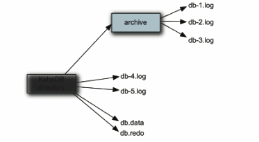

- db.data

  该文件包含了持久化消息的**B-Tree索引**，索引了消息数据记录中的消息，作为索引指向db-\<number>.log中存储的消息。

- db.free

  当前db.data文件里哪些页面是空闲的，文件具体内容是所有空闲页的ID。

- db.redo

  用来进行消息的恢复，如果KahaDB消息存储在强制退出后启动，用于恢复B-Tree索引。

- lock

  文件锁，表示当前获得KahaDB读写权限的Broker。

### 10.3 LevelDB

> https://activemq.apache.org/leveldb-store
>
> Available in ActiveMQ 5.8.0 but became unsupported as of 5.14.2, and was removed in 5.17.0.

从Active MQ V5.8之后引进，它和KahaDB非常相似，也是基于文件的本地数据库存储形式，但是它提供比KahaDB更快的持久性。

它不使用自定义B-Tree实现来索引预写日志，而是使用基于LevelDB的索引。

```xml
<broker brokerName="broker" ... >
    <persistenceAdapter>
      <levelDB directory="activemq-data"/>
    </persistenceAdapter>
 </broker>
```

### 10.4 JDBC

> https://activemq.apache.org/jdbc-support

#### 10.4.1配置MySQL

1. 添加MySQL JDBC jar包到Active MQ的lib目录下

2. 修改持久化方案

   ```xml
   <broker brokerName="broker">
       <!-- 默认配置 -->
       <persistenceAdapter>
         <kahaDB directory="${activemq.data}/kahadb" journalMaxFileLength="32mb"/>
       </persistenceAdapter>
       
       <!-- 修改为MySQL -->
       <persistenceAdapter>
       	<jdbcPersistenceAdapter dataSource="#mysql-ds"/>
   	</persistenceAdapter>
   </broker>
   ```

   dataSource: 指定将要引用的持久化数据库的bean名称；

   createTablesOnStartup: 是否在启动的时候创建数据库，默认值是 `true`，一般是第一次启动的时候设置为 `true` 之后改为 `false`。

3. 配置数据库连接

   ```xml
   <bean id="mysql-ds" class="org.apache.commons.dbcps2.BasicDataSource" destory-method="close">
   	<property name="driverClassName" value="com.mysql.jdbc.Driver" />
       <property name="url" value="jdbc:mysql://" />
       <property name="username" value="" />
       <property name="password" value="" />
       <property name="maxTotal" value="200" />
       <property name="poolPreparedStatements" value="true" />
   </bean>
   ```

4. 建仓SQL和建表说明

   - 创建数据库
   - 表说明
     - ACTIVEMQ_MSGS：消息
       - CONTAINER: 消息的Destination
       - MSGID_PROD: 消息发送者的主键
       - MSG_SEQ: 消息的发送顺序，MSGID_PROD+MSG_SEQ可以组成JMS的MessageID
       - EXPIRATION: 消息的过期时间，时间戳
       - MSG: 消息本体的Java序列化对象的二进制数据
       - PRIORITY: 优先级，从0-9，数值越大优先级越高
     - ACTIVEMQ_ACKS：持久订阅的消息和最后一个持久订阅接收的消息ID
       - CONTAINER: 消息的Destination
       - SUB_DEST: 如果是使用Static集群，这个字段会有集群其他系统的信息
       - CLIENT_ID: 每个订阅者都必须有一个唯一的客户端ID
       - SUB_NAME: 订阅者名称
       - SELECTOR: 选择器，可以选择只消费满足条件的消息。条件可以用自定义属性实现，可支持多属性AND和OR操作
       - LAST_ACKED_ID: 记录最后消费过的消息的ID
     - ACTIVEMQ_LOCK：在集群环境中才有用，只有一个Broker可以获得消息，称为Master Broker，其他的只能作为备份等待Master Broker不可用，才可能成为下一个Master Broker。这个表用于记录哪个Broker是当前的Master Broker
       - ID
       - Broker Name

#### 10.4.2 使用验证

> 一定要开启持久化。

- 队列：消息一旦被Consumer消费，消息就会从Broker的ACTIVEMQ_MSGS表中删除
- 主题：订阅者被存放在ACTIVEMQ_ACKS表中

#### 10.4.3 踩坑

1. MySQL持久化层，需要添加 `mysql-jdbc.jar` 到Active MQ的lib目录中

2. createTablesOnStartup: 是否在启动的时候创建数据库，默认值是 `true`，一般是第一次启动的时候设置为 `true` 之后改为 `false`

3. 下划线

   `java.lang.IllegalStateException: BeanFactory not initialized or already closed`，因为操作系统设备名称中有“_”，需要修改操作系统设备名称。

#### 10.4.4 JDBC With Journal

> For long term persistence we recommend using JDBC coupled with our high performance journal. You can use just JDBC if you wish but its quite slow.
>
> To achieve high performance of durable messaging in ActiveMQ V4.x we strongly recommend you use our high performance journal - **which is enabled by default**. This works rather like a database; messages (and transcation commits/rollbacks and message acknowledgements) are written to the journal as fast as is humanly possible - then at intervals we checkpoint the journal to the long term persistence storage (in this case JDBC).

在Broker和MySQL之间增加一层高速缓存层，克服直接使用JDBC Store的不足：每次消息都需要写库和读库。它的原理是：当消费者的消费速度能够及时跟上生产者消息的生产速度时，journal文件能够大大减少需要写入到DB中的消息。

举个例子：生产者生产了1000条消息，这1000条消息会被保存在journal文件中，假设消费者的消费速度很快，在journal文件还没有同步到DB之前，消费者已经消费了90%的消息，那么这个时候只需要同步**剩下的10%**的消息到DB中；如果消费者的消费速度很慢，那么journal文件则可以使用**批量写入**的方式写入到DB中。

```xml
<persistenceFactory>
    <journalPersistenceAdapterFactory journalLogFiles="5" journalLogFileSize="32768" dataDirectory="${basedir}/target" dataSource="#mysql-ds" /> 
</persistenceFactory>
```

#### 10.4.5 总结

- 持久化消息主要是指：

  MQ所在的服务器宕机后消息不会丢失的机制。

- 持久化机制演化过程：

  从最初的AMQ Message Store方案到ActiveMQ V4版本中推出的High performance journal (高性能事务支持〉附件，并且同步推出了关于关系型数据库的存储方案。ActiveMQ5.3版本中又推出了对KahaDB的支持（V5.4版本后称为ActveMQ默认的持久化方案），后来ActveMQV5.8版本开始支持LevelDB，到现在，V5.9+版本提供了标准的ZookeepertLevelDB集群化方案，在V5.14.2版本官方决定启用LevelDB，在V5.17.0版本移除了LevelDB。

- ActiveMQ的消息持久化机制有：

  AMQ - 基于日志文件
  KahaDB - 基于日志文件，从ActiveMQ 5.4开始默认的持久化插件
  JDBC - 基于第3方数据库
  LevelDB - 基于文件的本地数据库储存，从ActiveMQ 5.8版本之后又推出了LevelDB的持久化引擎性能高于KahaDB
  Replicated LeveIDB Store - 从ActiveMQ 5.9提供了基于LevelDB和Zookeeper的数据复制方式，用于Master-slave方式的首选数据复制方案

- 持久化消息的存储逻辑：

  在生产者将消息发送出去后：

  1. 消息中心首先将消息存储到本地数据文件、内存数据库或者远程数据库等
  2. 然后试图将消息发送给接收者，发送成功则将消息从存储中删除失败则继续尝试。

  消息中心启动以后首先要检查指定的存储位置，如果有未发送成功的消息则需要把消息发送出去。

## 十一、高级特性

### 11.1 高可用

### 11.2 异步投递

> https://activemq.apache.org/async-sends
>
> ActiveMQ supports sending messages to a broker in sync or async mode.
>
> The good news is that ActiveMQ sends message in async mode by default in several cases.

#### 11.2.1 解释

ActiveMQ支持同步、异步两种发送的模式将消息发送到broker，模式的选择对发送延时有巨大的影响。Producer能达到怎样的产出率(产出率=发送数据总量/时间)主要受发送延时的影响，使用异步发送可以显著的提高发送的性能。
**ActiveMQ默认使用异步发送的模式**：除非明确指定使用同步发送的方式或者在未使用事务的前提下发送持久化的消息，这两种情况都是同步发送的。
如果你**没有使用事务且发送的是持久化的消息**，每一次发送都是**同步**发送的且会**阻塞**Producer直到Broker返回一个确认，表示消息已经被安全的持久化到磁盘。确认机制提供了消息安全的保障，但同时会阻塞客户端带来了很大的延时。
很多高性能的应用，**允许在失败的情况下有少量的数据丢失**。如果你的应用满足这个特点，你可以使用异步发送来提高生产率，即使发送的是持久化的消息。

**异步发送**它可以最大化Producer端的发送效率。我们通常在发送消息量比较密集的情况下使用异步发送，它可以很大的提升Producer性能；不过这也带来了额外的问题：就是需要**消耗较多的Client端内存**同时也会**导致Broker端性能消耗增加**；此外它**不能有效的确保消息的发送成功**。在 `useAsyncSend=true` 的情况下客户端**需要容忍消息丢失的可能**。

#### 11.2.2 配置

```java
// Configuring Async Send using a Connection URI
cf = new ActiveMQConnectionFactory("tcp://locahost:61616?jms.useAsyncSend=true");

// Configuring Async Send at the ConnectionFactory Level
((ActiveMQConnectionFactory)connectionFactory).setUseAsyncSend(true);

// Configuring Async Send at the Connection Level
((ActiveMQConnection)connection).setUseAsyncSend(true);
```

#### 11.2.3 如何确认消息发送成功？

异步发送丢失消息的场景是：生产者设置 `UseAsyncSend=true`，使用 `Producer.send(msg)` 持续发送消息。**由于消息不阻塞，生产者会认为所有send的消息均被成功发送至MQ。**
如果MQ突然宕机，此时生产者端内存中尚未被发送至MQ的消息**都会丢失**。所以，正确的异步发送方法是需要**接收回调`AsyncCallback()`**的。同步发送和异步发送的区别就在此：

- 同步发送等send不阻塞了就表示一定发送成功了
- **异步发送需要接收回执并由客户端再判断一次是否发送成功**

### 11.3 延迟投递和定时投递

> https://activemq.apache.org/delay-and-schedule-message-delivery

#### 11.3.1 解释

> ActiveMQ from version **5.4** has an optional persistent scheduler built into the ActiveMQ message broker. It is enabled by setting the broker **schedulerSupport** attribute to true in the [Xml Configuration](https://activemq.apache.org/xml-configuration). An ActiveMQ client can take advantage of a delayed delivery by using the following message properties:

| Property name        | type   | description                                                  |
| -------------------- | ------ | ------------------------------------------------------------ |
| AMQ_SCHEDULED_DELAY  | long   | The time in milliseconds that a message will wait before being scheduled to be delivered by the broker |
| AMQ_SCHEDULED_PERIOD | long   | The time in milliseconds to wait after the start time to wait before scheduling the message again |
| AMQ_SCHEDULED_REPEAT | int    | The number of times to repeat scheduling a message for delivery |
| AMQ_SCHEDULED_CRON   | String | Use a Cron entry to set the schedule                         |

#### 11.3.2 配置

```xml
<broker schedulerSupport="true"> ... </broker>
```

1. 消息延迟

   ```java
   MessageProducer producer = session.createProducer(destination);
   TextMessage message = session.createTextMessage("test msg");
   long delay = 30 * 1000;
   long period = 10 * 1000;
   int repeat = 9;
   message.setLongProperty(ScheduledMessage.AMQ_SCHEDULED_DELAY, delay);
   message.setLongProperty(ScheduledMessage.AMQ_SCHEDULED_PERIOD, period);
   message.setIntProperty(ScheduledMessage.AMQ_SCHEDULED_REPEAT, repeat);
   producer.send(message);
   ```

2. CRON

   ```java
   MessageProducer producer = session.createProducer(destination);
   TextMessage message = session.createTextMessage("test msg");
   message.setStringProperty(ScheduledMessage.AMQ_SCHEDULED_CRON, "0 * * * *");
   producer.send(message);
   ```

3. CRON 调度优先于使用消息延迟

   ```java
   MessageProducer producer = session.createProducer(destination);
   TextMessage message = session.createTextMessage("test msg");
   message.setStringProperty(ScheduledMessage.AMQ_SCHEDULED_CRON, "0 * * * *");
   message.setLongProperty(ScheduledMessage.AMQ_SCHEDULED_DELAY, 1000);
   message.setLongProperty(ScheduledMessage.AMQ_SCHEDULED_PERIOD, 1000);
   message.setIntProperty(ScheduledMessage.AMQ_SCHEDULED_REPEAT, 9);
   producer.send(message);
   ```

   CRON scheduling takes priority over using message delay - however, if a repeat and period is set with a CRON entry, the ActiveMQ scheduler will schedule delivery of the message for every time the CRON entry fires. Easier to explain with an example. **Supposing that you want a message to be delivered 10 times, with a one second delay between each message - and you wanted this to happen every hour.**

### 11.4 分发策略


### 11.5 消费重试

> https://activemq.apache.org/redelivery-policy
>
> Detail on when messages are redelivered to a client can be found in the [Message Redelivery and DLQ Handling](https://activemq.apache.org/message-redelivery-and-dlq-handling) section. You can configure the [RedeliveryPolicy](http://svn.apache.org/viewvc/activemq/trunk/activemq-client/src/main/java/org/apache/activemq/RedeliveryPolicy.java?view=markup) on your [ActiveMQConnectionFactory](http://svn.apache.org/viewvc/activemq/trunk/activemq-client/src/main/java/org/apache/activemq/ActiveMQConnectionFactory.java?view=markup) or [ActiveMQConnection](http://svn.apache.org/viewvc/activemq/trunk/activemq-client/src/main/java/org/apache/activemq/ActiveMQConnection.java?view=markup) to customize exactly how you want the redelivery to work.
>
> You can use Java code, Spring or the [Connection Configuration URI](https://activemq.apache.org/connection-configuration-uri) to customize this.

#### 11.5.1 哪些情况下会引起消息重发？ 

1. Client用了事务且在session中调用了 `rollback()`
2. Client用了事务且在调用 `commit()` 之前关闭或者没有 `commit()`
3. Client在 `CLIENT_ACKNOWLEDGE` 的模式下，在session中调用了 `recover()`

#### 11.5.2 重发间隔 & 重发次数

1000ms & 6（失败之后重发6次：1+6）

| Property                     | Default Value | Description                                                  |
| ---------------------------- | ------------- | ------------------------------------------------------------ |
| `backOffMultiplier`          | `5`           | The back-off multiplier.                                     |
| `collisionAvoidanceFactor`   | `0.15`        | The percentage of range of collision avoidance if enabled.   |
| **`initialRedeliveryDelay`** | `1000L`       | The initial redelivery delay in milliseconds.                |
| **`maximumRedeliveries`**    | `6`           | Sets the maximum number of times a message will be redelivered before it is considered a **poisoned pill** and returned to the broker so it can go to a Dead Letter Queue. Set to `-1` for unlimited redeliveries. |
| `maximumRedeliveryDelay`     | `-1`          | Sets the maximum delivery delay that will be applied if the `useExponentialBackOff` option is set. (use value `-1` to define that no maximum be applied) (v5.5). |
| `redeliveryDelay`            | `1000L`       | The delivery delay if `initialRedeliveryDelay=0` (v5.4).     |
| `useCollisionAvoidance`      | `false`       | Should the redelivery policy use collision avoidance.        |
| `useExponentialBackOff`      | `false`       | Should exponential back-off be used, i.e., to exponentially increase the timeout. |

#### 11.5.3 有毒消息Poison ACK

一个消息被 redelivedred 超过默认的最大重发次数（默认6次）时，消费端会给MQ发送一个 `poison ack` 表示这个消息有毒，告诉Broker不要再发了，这个时候Broker会把这个消息放到DLQ（死信队列）中。

#### 11.5.4 Java

```java
// 方式一
ActiveMQConnection connection ...  // Create a connection

RedeliveryPolicy queuePolicy = new RedeliveryPolicy();
queuePolicy.setInitialRedeliveryDelay(0);
queuePolicy.setRedeliveryDelay(1000);
queuePolicy.setUseExponentialBackOff(false);
queuePolicy.setMaximumRedeliveries(2);

RedeliveryPolicy topicPolicy = new RedeliveryPolicy();
topicPolicy.setInitialRedeliveryDelay(0);
topicPolicy.setRedeliveryDelay(1000);
topicPolicy.setUseExponentialBackOff(false);
topicPolicy.setMaximumRedeliveries(3);

// Receive a message with the JMS API
RedeliveryPolicyMap map = connection.getRedeliveryPolicyMap();
map.put(new ActiveMQTopic(">"), topicPolicy);
map.put(new ActiveMQQueue(">"), queuePolicy);

// 方式二
// 1. 创建连接工厂，使用默认用户名和密码
ActiveMQConnectionFactory connectionFactory = new ActiveMQConnectionFactory();

// 设置重发策略
RedeliveryPolicy redeliveryPolicy = new RedeliveryPolicy();
redeliveryPolicy.setMaximumRedeliveries(4);
connectionFactory.setRedeliveryPolicy(redeliveryPolicy);

// 2. 获取连接
Connection connection = connectionFactory.createConnection();

// 方式三，spring xml
<!-- 重发策略 -->
<bean id="redeliveryPolicy" class="org.apache.activemq.RedeliveryPolicy">
    <property name="maximumRedeliveries" value="3" />
    <property name="initialRedeliveryDelay" value="200" />
    <!-- 在每次尝试重新发送失败后，增长等待时间 -->
    <property name="useExponentialBackOff" value="true" />
    <!-- 第一次失败后重新发送之前等待时间倍数，第一次 x ms，第二次 x*2 ms，只在 useExponentialBackOff = true 时有效 -->
    <property name="backOffMultiplier" value="2" />
    <!-- 最大传送延迟，只在 useExponentialBackOff = true 时有效 -->
    <property name="maximumRedeliveryDelay" value="1000" />
</bean>
```

### 11.6 死信队列

> https://activemq.apache.org/message-redelivery-and-dlq-handling

死信队列（Dead Letter Queue），开发人员可对DLQ进行人工干预。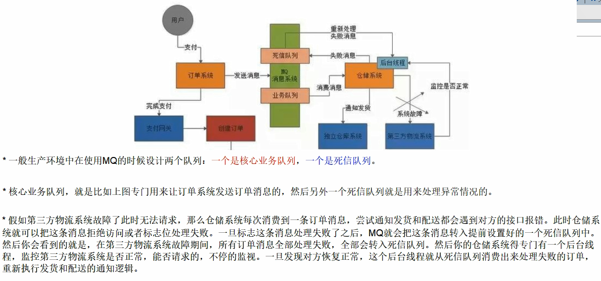

- SharedDeadLetterStrategy：死信保存的共享队列（默认）

- IndividualDeadLetterStrategy：死信保存到各自的死信通道
- 自动删除过期消息

```xml
<destinationPolicy>
   <policyMap>
     <policyEntries>
       <!-- Set the following policy on all queues using the '>' wildcard -->
       <policyEntry queue=">">
         <!-- 
           Tell the dead letter strategy not to process expired messages
           so that they will just be discarded instead of being sent to
           the DLQ 
         -->
         <deadLetterStrategy>
           <sharedDeadLetterStrategy processExpired="false" />
         </deadLetterStrategy>
       </policyEntry>
     </policyEntries>
   </policyMap>
</destinationPolicy>
```

- 存放非持久消息到死信队列中

  > By default, ActiveMQ will not place undeliverable *non-persistent* messages on the dead-letter queue.

  ```xml
  <destinationPolicy>
     <policyMap>
       <policyEntries>
         <!-- Set the following policy on all queues using the '>' wildcard -->
         <policyEntry queue=">">
           <!-- 
             Tell the dead letter strategy to also place non-persisted messages 
             onto the dead-letter queue if they can't be delivered.
           -->
           <deadLetterStrategy>
             <sharedDeadLetterStrategy processNonPersistent="true" />
           </deadLetterStrategy>
         </policyEntry>
       </policyEntries>
     </policyMap>
  </destinationPolicy>
  ```

- 通配符

  **Set the following policy on all queues using the '>' wildcard.**

### 11.7 防止重复消费 - 幂等性

**web应用防止表单重复提交。**

网络延迟传输中，会操作进行MQ重试，在重试过程中，可能会造成重复消费。

1. 如果消息是做数据库的插入操作，给这个消息做一个唯一主键，那么就算出现重复消费的情况，也会导致主键冲突，避免数据库出现脏数据
2. 准备一个第三方服务方做消费记录：以redis为例，给消息分配一个全局id，只要消费过该消息，将<id, message>以K-V形式写入redis；那么当消费者开始消费前，首先去redis中查询有没有消费记录即可

